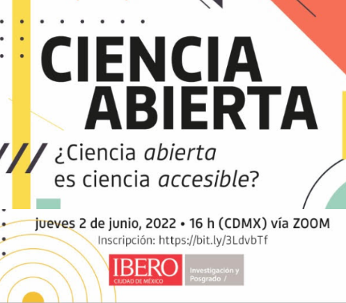

class: front middle center

```{r eval=FALSE, include=FALSE}
# Correr esto para que funcione el infinite moonreader, el root folder debe ser static para si dirigir solo "bajndo" en directorios hacia el bib y otros

xaringan::inf_mr('/static/docpres/02_bases/2mlmbases.Rmd')

o en RStudio:
  - abrir desde carpeta root del proyecto
  - Addins-> infinite moon reader
```


```{r setup, include=FALSE, cache = FALSE}
require("knitr")
options(htmltools.dir.version = FALSE)
pacman::p_load(RefManageR)
# bib <- ReadBib("../../bib/electivomultinivel.bib", check = FALSE)
opts_chunk$set(warning=FALSE,
             message=FALSE,
             echo=FALSE,
             cache = FALSE, fig.width=7, fig.height=5.2)
pacman::p_load(flipbookr, tidyverse)
```


```{r xaringanExtra, echo=FALSE}
xaringanExtra::use_xaringan_extra(c("tile_view", "animate_css"))
xaringanExtra::use_progress_bar(color = "red", location = "top")

# xaringanExtra::use_share_again()
# xaringanExtra::use_scribble()
```

<!---
About macros.js: permite escalar las imágenes como [scale 50%](path to image), hay si que grabar ese archivo js en el directorio.
--->

.pull-left-narrow[

.left[


<br>
<br>
<br>
 

]

]


.pull-right-wide[

.right[
.content-box-gray[

 ## .red[**Herramientas para la apertura del flujo de investigación científica**]
 
.small[Juan Carlos Castillo 

Sociología, Universidad de Chile]
.small[[jc-castillo.com](https://jc-castillo.com/)

]
]
]
]

---
class: center
<br>


---

<br>


---
<br>
 


---
<br>
 


---
<br>
 


---
<br>
 


---

.pull-left-narrow[
<br>
.content-box-red[

<br>
# Algunos desafíos

<br>
<br>
]
]

.pull-right-wide[
<br>
<br>
<br>

- Resguardo de propiedad intelectual

- Capacidades técnicas

- Tiempo, recursos y desigualdad en la producción
]
---
class: front center
.right[

]

# .red[¡Muchas gracias!]

más información en:

### [.red[lisa-coes.com]](https://lisa-coes.com/)


### .medium[**.black[Laboratorio de Investigación Social] .red[Abierta]]**


 


  