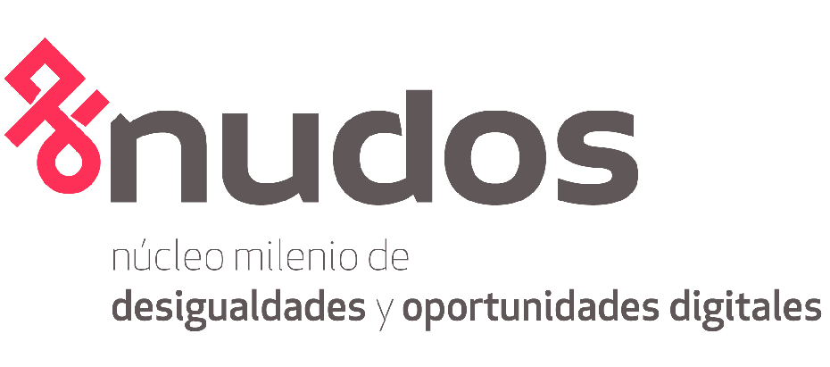
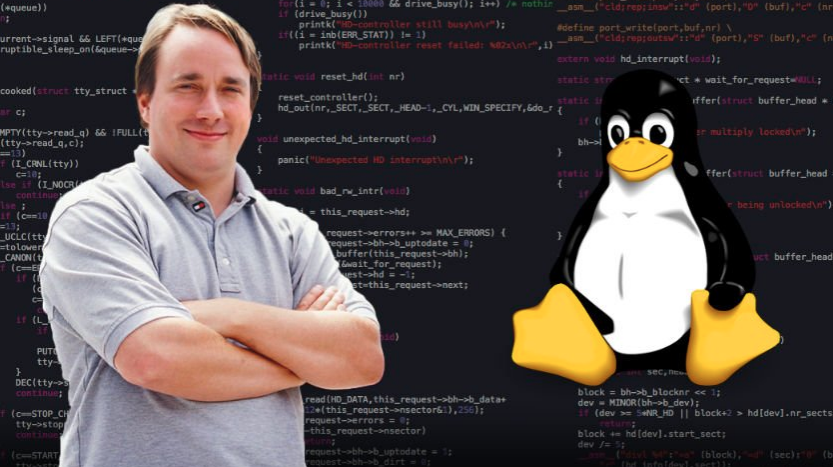
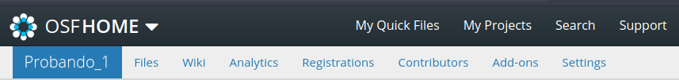

class: front middle center

```{r eval=FALSE, include=FALSE}
# Correr esto para que funcione el infinite moonreader, el root folder debe ser static para si dirigir solo "bajndo" en directorios hacia el bib y otros

xaringan::inf_mr('/static/docpres/02_bases/2mlmbases.Rmd')

o en RStudio:
  - abrir desde carpeta root del proyecto
  - Addins-> infinite moon reader
```


```{r setup, include=FALSE, cache = FALSE}
require("knitr") 
options(htmltools.dir.version = FALSE)
pacman::p_load(RefManageR)
# bib <- ReadBib("../../bib/electivomultinivel.bib", check = FALSE)
opts_chunk$set(warning=FALSE,
             message=FALSE,
             echo=FALSE,
             cache = FALSE, fig.width=7, fig.height=5.2)
pacman::p_load(flipbookr, tidyverse)
```


```{r xaringanExtra, echo=FALSE}
xaringanExtra::use_xaringan_extra(c("tile_view", "animate_css"))
xaringanExtra::use_progress_bar(color = "red", location = "top")

# xaringanExtra::use_share_again()
# xaringanExtra::use_scribble()
```

<!---
About macros.js: permite escalar las imágenes como [scale 50%](path to image), hay si que grabar ese archivo js en el directorio.
--->

.pull-left-narrow[

.left[

 

 


.small[Viernes 3 de Noviembre 2023]

]
]

.pull-right-wide[

.right[
.content-box-gray[
 ## **.red[Herramientas de Ciencia Abierta]**
----


**.red[Juan Carlos Castillo]** 
.small[
Departamento de Sociología - COES, Universidad de Chile]
.small[[.black[jc-castillo.com]](https://jc-castillo.com/)

]
]
]
.right[

]]


---

layout: true
class: animated, fadeIn

---
class: middle

.pull-left[
]

.pull-right[

#### El .red[Laboratorio de Investigación Social Abierta (LISA)] tiene por objetivo ofrecer herramientas y orientaciones para la apertura científica de las distintas etapas de los proyectos de investigación en ciencias sociales.
]
---

class: middle

 

---
class: center 

---
class: inverse center

## ¿Cómo organizamos el trabajo de investigación (en el momento del análisis y escritura)?

--
<br>

----

## ¿Qué precauciones tomamos en términos de .yellow[reproducibilidad]?

???

mano alzada, flinga
relacionar:
Diseño: estructura
Gestión: Flujo

Lámina final final final.docx

Vamos a partir por estructura: protocolo
Luego con herramientasque ayudan a una gestion abierta del proyecto
Texto plano / Markdown - Bibtex
Github
lamina de herramientas flujo ciencia abierta, enfatizar el concepto de reproducibilidad, Bowers


---
class: middle center 


---
## ¿Qué porcentaje de los estudios publicados son reproducibles?

.pull-left-wide[

]
.pull-right-narrow[
<br>
<br>
<br>
<br>
<br>
<br>
... alrededor de un **40%!** (... varía por disciplina)
]

---
class: center


.small[
Fuente: [Baker (2016) 1,500 scientists lift the lid on reproducibility - Nature](https://www.nature.com/news/1-500-scientists-lift-the-lid-on-reproducibility-1.19970)]

---
class: center middle


.small[
Fuente: [Baker (2016) 1,500 scientists lift the lid on reproducibility - Nature](https://www.nature.com/news/1-500-scientists-lift-the-lid-on-reproducibility-1.19970)]


---
class: middle 

.pull-left-wide[

]

.tiny[
.pull-right-narrow[
[Knudtson, K. L., et al (2019). Survey on Scientific Shared Resource Rigor and Reproducibility. Journal of Biomolecular Techniques : JBT, 30(3), 36–44. https://doi.org/10.7171/jbt.19-3003-001
](https://pubmed.ncbi.nlm.nih.gov/31452645/)
]

]

---
class: center 
.pull-left[
]

--


---
class: middle, center


---
class: inverse middle center

.content-box-gray[
## .red[1.Diseño -> Estructura]
]

<br>
.content-box-gray[
## .red[2.Gestión -> Flujo]
]

---
class: inverse middle center

.content-box-yellow[
## .red[1.Diseño -> Estructura]
]

<br>
.content-box-gray[
## .red[2.Gestión -> Flujo]
]


---
## Estructura 
.pull-left[
.content-box-red[
### .red[A. ad-hoc ]
  - cada investigador define numero de archivos, nombres, carpetas y organización
  
  - explicar al resto cómo se organiza
  - documentar en un archivo cómo se organiza
  
--> reproducibilidad y transparencia **LIMITADA**  
]]

--
.pull-right[
.content-box-green[
### .red[B. *Protocolo* reproducible]

  - **estructura** de carpetas y archivos interconectados que refieren a reglas conocidas (estándares)
  
  - **autocontenido**: toda la información necesaria para la reproducibilidad se encuentra en la carpeta raíz o directorio de trabajo.]
]
---
# .right[... estándares]

.center[

]

---

.pull-left-narrow[
## Ejemplo protocolo reproducible: [TIER](https://www.projecttier.org/)]
.pull-right-wide[
<br>
.center[

]
]
---
.pull-left-narrow[
## Ejemplo protocolo reproducible: [TIER](https://www.projecttier.org/)]
.pull-right-wide[
<br>
.center[

]
]


---
.center[

]

---
## Estructura IPO


---
class: middle center

## Mayores detalles y plantilla de carpetas:

<br>
.center[

## [https://lisa-coes.com/ipo-repro/](https://lisa-coes.com/ipo-repro/)

## [https://github.com/lisa-coes/ipo](https://lisa-coes.com/ipo-repro/)

]


---
class: inverse middle center

.content-box-gray[
## .red[1.Diseño -> Estructura]
]

<br>
.content-box-yellow[
## .red[2.Gestión -> Flujo]
]


---
class: roja right

# Elementos del flujo de trabajo reproducible

## A. Escritura en texto plano

## B. Carpeta autocontenida

## C. Control de versiones

---
class: roja right

# Elementos del flujo de trabajo reproducible

## .yellow[A. Escritura en texto plano]

## B. Carpeta autocontenida

## C. Control de versiones

---
## Flujo de trabajo con procesador de texto tradicional

.center[

]

---
## Abriendo el archivo de escritura tradicional


---
## Desventajas del procesador tradicional

.pull-left-wide[
.medium[

- Barrera de **pago/licencia** para acceder a contenidos (propiedad)

- Difícil **versionamiento** y llevar registro de quién hizo qué cambio, barrera a la reproducibilidad y colaboración 

- No permite un documento enteramente **reproducible** que combine texto y código de análisis (en caso de utilizarlo) ]
]

.pull-right-narrow[
<br>
<br>


]


---
.pull-left-narrow[
## Escritura libre y abierta
]

<br>
.pull-right-wide[
.content-box-red[
- independiente de programa comercial

- independiente de plataformas específicas

- permite combinar texto y análisis en un mismo documento

- foco en los contenidos en lugar del formato

- permite distintas opciones de formato final]]

---
# Inspiración

.center[
]

---

.pull-left-narrow[
## Escritura simple / plana
]

.pull-right-wide[
<br>
.content-box-red[
- entorno: editor de texto

- separación entre texto de entrada (input) y texto de salida (output)

- foco en el input/contenido vs output/formato

- marcas de edición: vínculo entre formato de input y output

- sin cortar / pegar
 ]
]
---
## Marcas de edición

- Vínculo entre escritura en texto simple (input) y output


---
## Principales Alternativas

.left-column[
## **Latex**

## .grey[Markdown]
]

.right-column[

- sistema de escritura simple de amplio uso en la academia

- alta calidad en salida a pdf

- creado a comienzos de los 80 (Donald Knuth, Leslie Lamport)


]

---
## Principales Alternativas

.left-column[
## **Latex**

## .grey[Markdown]
]

.right-column[


]

---
## Principales Alternativas

.left-column[
## .grey[Latex]

## **Markdown**
]

.right-column[

.medium[
- creado por John Gruber y Aaron Swartz en 2004

- forma de escritura simple con pocas marcas de formato

- conversión a distintos formatos de salida (html, pdf)

- Soporta encabezados, tablas, imágenes, tablas de contenidos, ecuaciones, links ...

- filosofía: foco en contenido primero, el formato después.
]

]


---
## Principales Alternativas

.left-column[
## .grey[Latex]

## **Markdown**
]

.right-column[
.right[
]
]

---
## Principales Alternativas

.left-column[
## .grey[Latex]

## **Markdown**
]
.right-column[
.right[
 
]]


---
## Principales Alternativas

<br>


|          	| **Control de formato** 	| **Marcas de edición** 	| **Formatos de salida** 	|
|----------	|:--------------------:|:----------------:|:--------------------:|
| LaTeX    	|          +         	|        +       	|          -         	|
| Markdown 	|          -         	|        -       	|          +         	|

---

## Markdown, pandoc y renderización


---
## Ejemplos de marcas de edición en Markdown

.content-box-red[
- Texto en **negrita** entre dos astericos: `**negrita**`

- Texto en *cursiva* con un asterico por lado: ` *cursiva*`

- Títulos se marcan con `#` al principio, subtítulos `##` , y así sucesivamente

- Imágenes: ``

- Links: `[](link-web)`]


---

# Recursos

## - [Tutorial de markdown online](https://www.markdowntutorial.com/es/)

## - [Markdown cheatsheet](https://www.markdownguide.org/cheat-sheet/)


---
class: roja right

# Elementos del flujo de trabajo reproducible

## A. Escritura en texto plano

## .yellow[B. Carpeta autocontenida]

## C. Control de versiones

---
# Carpeta autocontenida

- proyecto **autocontenido**: reproducible sin necesidad de archivos externos

- requisito: establecer **directorio de trabajo**

  - posición de referencia de todas las operaciones al interior del proyecto
  
  - también llamado **directorio raíz**
  
---
## Directorio de trabajo

- ej. forma tradicional en hoja de código R: 

  - `setwd(ruta-a-carpeta-de-proyecto)`

  - problemas: hace referencia a ruta local en el computador donde se está trabajando, por lo tanto no es reproducible y **se debe evitar**
  
- alternativa sugerida en R: **RStudio Projects**  


---
## Rutas relativas en código

- forma de "señalar el camino" para abrir y guardar archivos al interior de una carpeta de proyecto autocontenido (= sin referencias locales)

- este camino tiene básicamente 3 direcciones:

  - bajar -> hacia subcarpetas
  
  - subir -> hacia carpetas superiores
  
  - subir y bajar -> hacia otras subcarpetas 

---
## Rutas relativas: bajando

- para **"bajar"** hacia a una subcarpeta, simplemente damos la ruta de la carpeta/archivo

  - ej: si estoy en el archivo paper.Rmd (directorio raíz), y quiero incluir una imagen (directorio input/images/imagen.jpg), entonces la ruta es `input/images/imagen.jpg`
  
  - o para señalar la ruta al bib desde paper.Rmd (en raíz): `input/bib/referencias.bib`

---
## Rutas relativas: subiendo

- para **subir** se utilizan los caracteres `../` por cada nivel.

- Ej: si quiero guardar una tabla en el directorio raíz generada desde un archivo de código en la subcarpeta proc, entonces la ruta es `../tabla.html`

---
## Rutas relativas: subiendo y bajando 

- combinación de las anteriores

- Ej: para abrir la base de datos original en la subcarpeta input/data desde el código de procesamiento en la subcarpeta proc, entonces:

`../input/data/original.dat`


---
class: roja right

# Elementos del flujo de trabajo reproducible

## A. Escritura en texto plano

## B. Carpeta autocontenida

## .yellow[C. Control de versiones]


---
class: inverse

.pull-left[
.center[

]
]

--

.pull-right[
<br>
<br>
<br>
### ¿Cómo registrar de manera eficiente quién hizo qué y cuando en un archivo/documento?
]

---
class: roja middle center

## .yellow[La escritura en texto simple (como Markdown) permite implementar un sistema de control de versiones, además de herramientas de respaldo, colaboración y comunicación]

---
## El origen: Abriendo un sistema operativo

.pull-left[
<br>

]


.pull-right[
- Linus Torvalds, 1991 (21 años)

- Crea sistema operativo libre (**Linux**) y lo abre a la colaboración. Postea:

  - "I'm doing a (free) operating system (just a hobby, won't be big and professional..."

]
---
## Desarrollo del Linux Kernel


.pull-left[
<br>
<br>

]

.pull-right[
<br>

- version 1: 1994

- version 5: 2019

- Más de 11 mil colaboradores

- mas de 30 millones de líneas de código

- **¿versionamiento?**

]

---
##... más sobre Linux, Torvalds y código abierto 


Linus Torvalds TED Talk 

[https://www.youtube.com/watch?v=o8NPllzkFhE&t=156s](https://www.youtube.com/watch?v=o8NPllzkFhE&t=156s)

---
# Git

.pull-left-narrow[

]

.pull-right-wide[
- Torvalds crea **Git** en 2005 para poder llevar registro y administrar las distintas versiones de Linux

- Git quiere decir *incompetente* / *desagradable*.

- "I'm an egotistical bastard, and I name all my projects after myself. First 'Linux', now 'git'." (Torvalds, 2012)

]


???

Torvalds sarcastically quipped about the name git (which means unpleasant person in British English slang): "I'm an egotistical bastard, and I name all my projects after myself. First 'Linux', now 'git'."[24][25] The man page describes Git as "the stupid content tracker".[26] The read-me file of the source code elaborates further:[27]

The name "git" was given by Linus Torvalds when he wrote the very first version. He described the tool as "the stupid content tracker" and the name as (depending on your way):

random three-letter combination that is pronounceable, and not actually used by any common UNIX command. The fact that it is a mispronunciation of "get" may or may not be relevant.
stupid. contemptible and despicable. simple. Take your pick from the dictionary of slang.
"global information tracker": you're in a good mood, and it actually works for you. Angels sing, and a light suddenly fills the room.
"goddamn idiotic truckload of sh*t": when it breaks

---
.pull-left-narrow[
## Git: un software de control de versiones
]

.pull-right-wide[
<br>
.content-box-red[
- es una especie de memoria o registro local que guarda información sobre:

  - quién hizo un cambio
  - cuándo lo hizo
  - qué hizo

- mantiene la información de todos los cambios en la historia de la carpeta / repositorio local

- se puede sincronizar con repositorio remoto (ej. Github)]
]
---
.pull-left-narrow[
# Git / Github]

.pull-right-wide[
<br>
.content-box-purple[
- actualmente, Git / Github posee más de 100 millones de repositorios

- mayor fuente de código en el mundo

- ha transitado desde el mundo de desarrollo de software hacia distintos ámbitos de trabajo colaborativo y abierto

- entorno de trabajo que favorece la ciencia abierta]
]

---
class: white

.pull-left-narrow[
###.green[ Dos lógicas de versionamiento]

.black[1.Deltas]

<br>
<br>


.black[2.Imágenes (snapshots)]

**-> Git**
]

.pull-right-wide[


]

---
class: inverse middle right center

## .red[Git no es un registro de versiones de archivos específicos, sino de una .yellow[carpeta completa]]

<br>

### Guarda .yellow["fotos"] de momentos específicos de la carpeta, y esta foto se *saca* mediante un .yellow[commit]

---
class: white

.center[

]

---
# Commits

- El **commit** es el procedimiento fundamental del control de versiones

- Git no registra cualquier cambio que se "guarda", sino los que se "comprometen" (commit).

--

- En un **commit**
  - se seleccionan los archivos cuyo cambio se desea registrar (*stage*)
  - se registra lo que se está comprometiendo en el cambio (mensaje de commit)

---
## ¿Cuándo hacer un commit?

- según conveniencia

- sugerencias:

  - que sea un momento que requiera registro (momento de foto)
  
  - no para cambios menores
  
  - no esperar muchos cambios distintos que puedan hacer perder el sentido del commit

---
## Pasos básicos versionamiento Git local

- inicializar la carpeta como repositorio git (solo la primera vez)

- agregar (add) los cambios que se quieran comprometer al escenario de compromiso (stage)

- mensaje de commit

- commit

---
.pull-left-narrow[
<br>
# Uso
]

.pull-right-wide[

<br>
.content-box-green[
- tradicionalmente, git se usa directamente con comandos desde el **terminal** (git bash)

- actualmente, existen una serie de programas locales que facilitan el uso de Git, tanto específicos como también editores genéricos

- algunos programas de análisis de datos (R/Rstudio) tienen incorporados módulos para versionar con Git/Github

- recomendación actual: VSC (Visual Studio Code) - por Github copilot (IA)
]]


---
class: roja middle center


# .orange[Abriendo el proyecto completo de investigación]


(Bonus track)
---
# Abriendo mi proyecto

- En general, podemos acceder solo al **resultado** de un proyecto, usualmente un artículo

--

- Abriendo resultados: Academia.edu, Researchgate, SSRN, scienceopen ...

--

- ¿Es posible lograr apertura en las **distintas fases** del proceso de investigación?


---

.center[]

---


- El **Open Science Framework** es una plataforma web orientada a facilitar la apertura de los proyectos de investigación en sus distintas fases

- Permite la conexión con distintas herramientas y aplicaciones

---

.center[]

---

.center[]

---

# Funcionamiento básico OSF

- Proyectos de investigación: es básicamente una carpeta abierta de proyecto, con funciones adicionales 

- Para ello:

  - (abrir cuenta, gratuito)

  - generar un proyecto nuevo

  - agregar archivos (... o sincronizar con servicios como Drive, Dropbox o Github)

---
class: middle center


---
# Crear un nuevo proyecto


---
# Crear nuevo proyecto


---
## Vista de proyecto

---
# Privacidad

- por defecto, los repositorios se crean como privados

- para hacer públicos: -> _Make public_

---



- Files: carpetas/archivos del proyecto. 

- Wiki: información general sobre el proyecto

- Registrations: pre-registros

- Contributors: agregar colaboradores

- Add-ons: vincular aplicaciones

- Settings: opciones generales

---
.pull-left-narrow[

# Add-ons

Permiten vincular repositorios, carpetas/archivos que luego estarán disponibles en _Files_

]

<br>
.pull-right-wide[


]

---
.pull-left-narrow[
# Otras ventanas

.medium[
- **Citation**: para citar el proyecto (al ser creado ya es citable)

- **Components**: Son proyectos dentro de un proyecto mayor. Pueden tener los mismos colaboradores o no.]
]

.pull-right-wide[
.right[

]]


---
class: inverse

## **.red[Resumen]**

###Estructura: protocolo reproducible

### Flujo de trabajo:
  - texto plano
  - carpeta autocontenida
  - control de versiones

### Apertura de proyecto
  - OSF
---
class: middle center


# ¡gracias por su atención!

Más info:

[lisa-coes.com](https://lisa-coes.com/)

[](https://github.com/lisa-coes/)

---
class: front

.pull-left-narrow[

.left[

 

 


.small[Viernes 3 de Noviembre 2023]

]
]

.pull-right-wide[

.right[
.content-box-gray[
 ## **.red[Herramientas de Ciencia Abierta]**
----


**.red[Juan Carlos Castillo]** 
.small[
Departamento de Sociología - COES, Universidad de Chile]
.small[[.black[jc-castillo.com]](https://jc-castillo.com/)

]
]
]
.right[

]]


