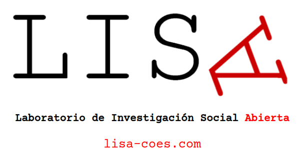
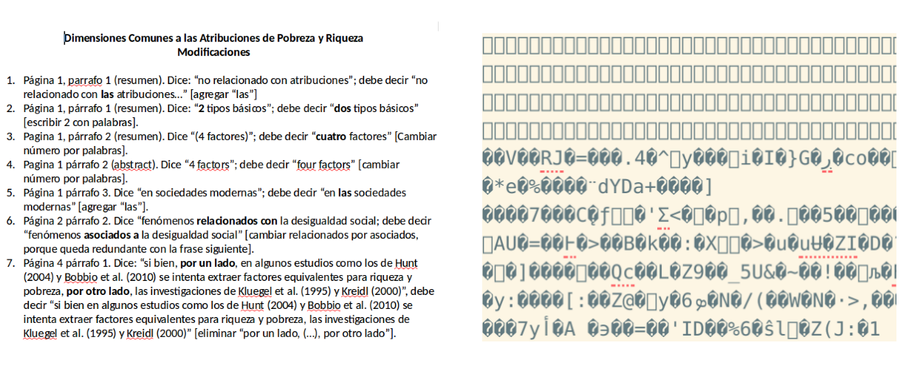
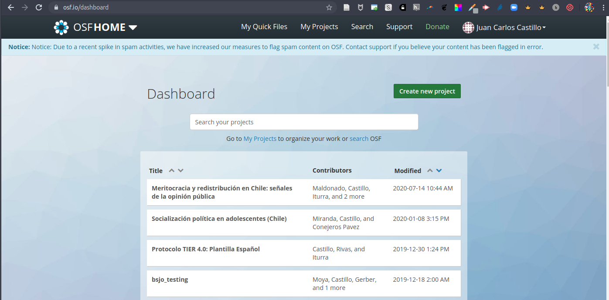

class: front middle center

```{r eval=FALSE, include=FALSE}
# Correr esto para que funcione el infinite moonreader, el root folder debe ser static para si dirigir solo "bajndo" en directorios hacia el bib y otros

xaringan::inf_mr('/static/docpres/02_bases/2mlmbases.Rmd')

o en RStudio:
  - abrir desde carpeta root del proyecto
  - Addins-> infinite moon reader
```


```{r setup, include=FALSE, cache = FALSE}
require("knitr") 
options(htmltools.dir.version = FALSE)
pacman::p_load(RefManageR)
# bib <- ReadBib("../../bib/electivomultinivel.bib", check = FALSE)
opts_chunk$set(warning=FALSE,
             message=FALSE,
             echo=FALSE,
             cache = FALSE, fig.width=7, fig.height=5.2)
pacman::p_load(flipbookr, tidyverse)
```


```{r xaringanExtra, echo=FALSE}
xaringanExtra::use_xaringan_extra(c("tile_view", "animate_css"))
xaringanExtra::use_progress_bar(color = "red", location = "top")

# xaringanExtra::use_share_again()
# xaringanExtra::use_scribble()
```

<!---
About macros.js: permite escalar las imágenes como [scale 50%](path to image), hay si que grabar ese archivo js en el directorio.
--->

.pull-left-narrow[

.left[

 

 



.small[Universidad de Valparaíso

Martes 9 de Enero 2024]

]
]

.pull-right-wide[

.right[
.content-box-gray[


# **.red[Herramientas de Ciencia Abierta]**

####Apertura y reproducibilidad de proyectos de investigación
----


]

### **.red[Juan Carlos Castillo]** 
.small[
Departamento de Sociología - COES, Universidad de Chile]
.small[[.red[jc-castillo.com]](https://jc-castillo.com/)

]
]
]


---

layout: true
class: animated, fadeIn

---
class: middle

.pull-left[
]

.pull-right[

#### El .red[Laboratorio de Investigación Social Abierta (LISA)] tiene por objetivo ofrecer herramientas y orientaciones para la apertura científica de las distintas etapas de los proyectos de investigación en ciencias sociales.
]

<br>
.center[
.content-box-red[
# [.red[lisa-coes.com]](https://lisa-coes.com/)]
]

---
class: inverse bottom right

.pull-right-wide[
# Nociones iniciales
]

---
class: middle
.content-box-red[
## Ciencia abierta, investigación & herramientas
]
 

---
class: center 

---
class: inverse center

### ¿Cómo organizamos el trabajo de investigación (en el momento del .yellow[análisis y escritura])?

--
<br>

----

### ¿Qué precauciones tomamos en términos de .yellow[reproducibilidad]?

???

mano alzada, flinga
relacionar:
Diseño: estructura
Gestión: Flujo

Lámina final final final.docx

Vamos a partir por estructura: protocolo
Luego con herramientasque ayudan a una gestion abierta del proyecto
Texto plano / Markdown - Bibtex
Github
lamina de herramientas flujo ciencia abierta, enfatizar el concepto de reproducibilidad, Bowers


---
class: middle center 


---
## ¿Qué porcentaje de los estudios publicados son reproducibles?

.pull-left-wide[

]
.pull-right-narrow[
<br>
<br>
<br>
<br>
<br>
<br>
... alrededor de un **40%!** (... varía por disciplina)
]

---
class: center


.small[
Fuente: [Baker (2016) 1,500 scientists lift the lid on reproducibility - Nature](https://www.nature.com/news/1-500-scientists-lift-the-lid-on-reproducibility-1.19970)]

---
class: center middle


.small[
Fuente: [Baker (2016) 1,500 scientists lift the lid on reproducibility - Nature](https://www.nature.com/news/1-500-scientists-lift-the-lid-on-reproducibility-1.19970)]


---
class: center 
.pull-left[
]

--


---
class: middle, center


---
class: inverse middle 

## .red[Herramientas]


### 1. .yellow[Protocolo reproducible]
### 2. Escritura reproducible
### 3. Apertura del proyecto de investigación
### 4. Pre-registros

---
## Organización del proyecto
.pull-left[
.content-box-red[
#### .red[A. Estructura ad-hoc ]
  - cada investigador define numero de archivos, nombres, carpetas y organización
  
  - explicar al resto cómo se organiza
  - documentar en un archivo cómo se organiza
  
--> reproducibilidad y transparencia **LIMITADA**  
]]

--
.pull-right[
.content-box-green[
#### .red[B. *Protocolo* reproducible]

  - **estructura** de carpetas y archivos interconectados que refieren a reglas conocidas (estándares)
  
  - **autocontenido**: toda la información necesaria para la reproducibilidad se encuentra en la carpeta raíz o directorio de trabajo.]
]
---
# .right[... estándares]

.center[

]

---

.pull-left-narrow[
## Ejemplo protocolo reproducible: [TIER](https://www.projecttier.org/)]
.pull-right-wide[
<br>
.center[

]
]
---
.pull-left-narrow[
## Ejemplo protocolo reproducible: [TIER](https://www.projecttier.org/)]
.pull-right-wide[
<br>
.center[

]
]


---
.center[

]

---
## Estructura IPO


---
class: middle center

## Mayores detalles y plantilla de carpetas:

<br>
.center[

## [https://lisa-coes.com/ipo-repro/](https://lisa-coes.com/ipo-repro/)

## [https://github.com/lisa-coes/ipo](https://lisa-coes.com/ipo-repro/)

]


---
class: inverse middle 

## .red[Herramientas]


### 1. Protocolo reproducible
### 2. .yellow[Escritura reproducible]
### 3. Apertura del proyecto de investigación
### 4. Pre-registros

---
## Flujo de trabajo con procesador de texto tradicional

.center[

]

---
## Abriendo el archivo de escritura tradicional



---
## Desventajas del procesador tradicional

.pull-left-wide[
.medium[

- Barrera de **pago/licencia** para acceder a contenidos (propiedad)

- Difícil **versionamiento** y llevar registro de quién hizo qué cambio, barrera a la reproducibilidad y colaboración 

- No permite un documento enteramente **reproducible** que combine texto y código de análisis (en caso de utilizarlo) ]
]

.pull-right-narrow[
<br>
<br>

]

---
.pull-left-narrow[
## Escritura libre y abierta
]

<br>
.pull-right-wide[
.content-box-red[
- independiente de programa comercial

- independiente de plataformas específicas

- permite combinar texto y análisis en un mismo documento

- foco en los contenidos en lugar del formato

- permite distintas opciones de formato final]]

---
# Inspiración

.center[
]

---

.pull-left-narrow[
## Escritura simple / plana
]

.pull-right-wide[
<br>
.content-box-red[
- entorno: editor de texto

- separación entre texto de entrada (input) y texto de salida (output)

- foco en el input/contenido vs output/formato

- marcas de edición: vínculo entre formato de input y output

- sin cortar / pegar
 ]
]
---
## Marcas de edición

- Vínculo entre escritura en texto simple (input) y output


---
## Principales Alternativas

.left-column[
## **Latex**

## .grey[Markdown]
]

.right-column[

- sistema de escritura simple de amplio uso en la academia

- alta calidad en salida a pdf

- creado a comienzos de los 80 (Donald Knuth, Leslie Lamport)


]

---
## Principales Alternativas

.left-column[
## **Latex**

## .grey[Markdown]
]

.right-column[


]

---
## Principales Alternativas

.left-column[
## .grey[Latex]

## **Markdown**
]

.right-column[

.medium[
- creado por John Gruber y Aaron Swartz en 2004

- forma de escritura simple con pocas marcas de formato

- conversión a distintos formatos de salida (html, pdf)

- Soporta encabezados, tablas, imágenes, tablas de contenidos, ecuaciones, links ...

- filosofía: foco en contenido primero, el formato después.
]

]


---
## Principales Alternativas

.left-column[
## .grey[Latex]

## **Markdown**
]

.right-column[
.right[
]
]

---
## Principales Alternativas

.left-column[
## .grey[Latex]

## **Markdown**
]
.right-column[
.right[
 
]]


---
## Principales Alternativas

<br>


|          	| **Control de formato** 	| **Marcas de edición** 	| **Formatos de salida** 	|
|----------	|:--------------------:|:----------------:|:--------------------:|
| LaTeX    	|          +         	|        +       	|          -         	|
| Markdown 	|          -         	|        -       	|          +         	|

---

## Markdown, pandoc y renderización


---
## Ejemplos de marcas de edición en Markdown

.content-box-red[
- Texto en **negrita** entre dos astericos: `**negrita**`

- Texto en *cursiva* con un asterico por lado: ` *cursiva*`

- Títulos se marcan con `#` al principio, subtítulos `##` , y así sucesivamente

- Imágenes: ``

- Links: `[](link-web)`]


---

# Recursos

## - [Tutorial de markdown online](https://www.markdowntutorial.com/es/)

## - [Markdown cheatsheet](https://www.markdownguide.org/cheat-sheet/)


---
class: inverse middle 

## .red[Herramientas]


### 1. Protocolo reproducible
### 2. Escritura reproducible
### 3. .yellow[Apertura del proyecto de investigación]
### 4. Pre-registros
---
# Abriendo mi proyecto

- En general, podemos acceder solo al **resultado** de un proyecto, usualmente un artículo

--

- Abriendo resultados: Academia.edu, Researchgate, SSRN, scienceopen ...

--

- ¿Es posible lograr apertura en las **distintas fases** del proceso de investigación?


---

.center[]

---


- El **Open Science Framework** es una plataforma web orientada a facilitar la apertura de los proyectos de investigación en sus distintas fases

- Permite la conexión con distintas herramientas y aplicaciones

---

.center[]

---

.center[]

---

# Funcionamiento básico OSF

- Proyectos de investigación: es básicamente una carpeta abierta de proyecto, con funciones adicionales 

- Para ello:

  - (abrir cuenta, gratuito)

  - generar un proyecto nuevo

  - agregar archivos (... o sincronizar con servicios como Drive, Dropbox o Github)

---
class: middle center


---
# Crear un nuevo proyecto




---
# Crear nuevo proyecto


---
## Vista de proyecto

---
# Privacidad

- por defecto, los repositorios se crean como privados

- para hacer públicos: -> _Make public_

---


- Files: carpetas/archivos del proyecto. 

- Wiki: información general sobre el proyecto

- Registrations: pre-registros

- Contributors: agregar colaboradores

- Add-ons: vincular aplicaciones

- Settings: opciones generales

---
.pull-left-narrow[

# Add-ons

Permiten vincular repositorios, carpetas/archivos que luego estarán disponibles en _Files_

]

<br>
.pull-right-wide[


]

---
.pull-left-narrow[
# Otras ventanas

.medium[
- **Citation**: para citar el proyecto (al ser creado ya es citable)

- **Components**: Son proyectos dentro de un proyecto mayor. Pueden tener los mismos colaboradores o no.]
]

.pull-right-wide[
.right[

]]


---
class: inverse middle 

## .red[Herramientas]


### 1. Protocolo reproducible
### 2. Escritura reproducible
### 3. Apertura del proyecto de investigación
### 4. .yellow[Pre-registros]

---
class: roja, right

.pull-left[

# Pre-registros

]

.pull-right-wide[

### 1. .yellow[Prácticas cuestionables de investigación]
### 2. Pre-registros
### 3. Plantillas y OSF
]

---
## El caso de Pedro

- Pedro accede una base de datos con información sobre trabajadores sindicalizados en distintas empresas del país. 

--

- .bold[Sin tener una hipótesis previa], correlaciona  las variables: .green[participación en huelga] (1), .red[tiempo de afiliación sindical] (2) y .orange[tipo de contrato] (3)

--

- Observa que hay una correlación positiva entre tiempo sindicalizado y participación en huelgas (_r_ = 0,32)

--

- Posterior a mirar los datos establece una hipótesis: a mayor .red[tiempo de afiliación sindical] (x) existe mayor .green[participación en huelgas] (y)

---

- .red[No encuentra] resultados esperados en base a su hipótesis (tiempo de afiliación sindical impacta positivamente en la participación en huelgas)

--

- Ajusta la variable tiempo, .bold[eliminando casos] que llevan .red[menos de 2 años sindicalizados en la empresa], obteniendo una asociación significativa con probabilidad de error _p_ <0.05

--

- Finalmente .bold[excluye] a trabajadores a .orange[plazo fijo], manteniendo solo aquellos con contrato indefinido, obteniendo un _p_ <0.01

# .center[🤔?]
---

class: middle

las .red[prácticas cuestionables de investigación] refieren a las:

>  _"acciones que violan los valores tradicionales de la empresa de investigación y que pueden ser perjudiciales para el proceso de investigación"_ (National Academies of Science 1992 en Steneck, 2006, p. 58).

---
# Algunas consecuencias

- el problema *no es la exploración de datos*, sino su uso en reporte selectivo de resultados de investigación

--

- incrementa la posibilidad de rechazar erróneamente $H_0$

--

- exageraciones de efectos estimados, perjudicando la replicabilidad

--

- se confirma lo que uno está buscando, no lo que entregan los datos (y pierde sentido el recolectar datos, y hacer investigación empírica)

---
class: roja, right

.pull-left[

# Pre-registros

]

.pull-right-wide[

### 1. Prácticas cuestionables de investigación
### 2. .yellow[Pre-registros]
### 3. Plantillas y OSF
]

---
class: middle

## ¿Qué es un pre-registro?

_Un .bolder[pre-registro] es una marca .red[temporal] que busca dar cuenta del diseño de una investigación: .orange[(1) principales hipótesis], .orange[(2) recolección de datos] y .orange[(3) plan de análisis.]_


---
# Características de un pre-registro

- se crea un registro permanente y disponible del plan del estudio .orange[antes de "mirar" los datos]

- establece una fecha de publicación

- accesible y con opción de resguardo de anonimato de autores (p.ej. OSF)

- .bold[objetivo principal:] diferenciar aspectos especificados a priori (hipótesis y análisis) de aquellos más exploratorios 


---
# Ventajas de pre-registros

.pull-left[
- transparencia del diseño

- eficiencia en el análisis

- mantener el foco en la .bold[teoría]

- .red[no impide explorar], solo diferenciar .orange[intuiciones exploratorias] de .green[ hipótesis confirmatorias]]

- .bold[Encontrable]: se genera un .blue[.bold[DOI]] que permite citar

- Puede evitar conflictos por co-autorias

- Evitar situaciones de plagio 

.pull-right[
.center[

]
]

---

##  Importancia de las hipótesis confirmatorias

--

* la evidencia previa e hipótesis guiadas por teoría:
--
  
  * permite delimitar correctamente el .orange[fenómeno a explicar] (_explanandum_) y
  
  * establecer cuál(es) conceptos/variables lo explican (_explanans_)
  
  * la .red[discusión] de resultados abre el camino para investigaciones posteriores

---
# Tipos de preregistro

- **Preregistro (sin revisión)**: simplemente detallar hipótesis, datos y análisis y registar en repositorio apropiado

--

- **Reporte registrado (con revisión)** : 
  - se somete a revisión en revista que permita esta opción
  - de ser aceptado, se publicará independiente de sus resultados
  - permite lidiar con el [.bold[sesgo de publicación]](https://lisa-coes.github.io/lisa-book/por-qu%C3%A9.html#pr%C3%A1cticas-cuestionables-de-investigaci%C3%B3n-qrp)

--

- **Reporte preregistrado de replicación**: para estudios de replicación (misma hipótesis y método, distintos datos)

---
class: roja, right

.pull-left[

# Pre-registros

]

.pull-right-wide[

### 1. Prácticas cuestionables de investigación
### 2. Pre-registros
### 3. .yellow[Plantillas y OSF]
]


---
## Algunos repositorios de pre-prints

* [**Open Science Framework**](https://osf.io/) - la más ampliamente aplicable en las ciencias sociales

* [**AsPredicted.org**](https://aspredicted.org/) - Utilizado principalmente en el ámbito de la psicología

* [**AEA Registry**](http://www.socialscienceregistry.org/) - Se utiliza principalmente en economía

* [**EGAP**](https://egap.org/registry/)  - Ciencia Política principalmente


Fuente: [meta-meta-resources.org](https://meta-meta-resources.org/running-studies/preparation/pre-reg-repos/)

---
## Plantillas de pre-registro

```{r echo=FALSE}
shiny::includeHTML(path = "https://lisa-coes.github.io/presentaciones/workshopelsoc-septiembre2022/tab-preregister.html")
```

Fuente: [lisa-coes.com/01componentes/](https://lisa-coes.com/01componentes/)

<!-- --- -->
<!-- # Características de plantillas -->

<!-- - formato de pre-registro que especifica .red[campos a completar] con información necesaria -->

<!-- - existen distintas alternativas según .red[diseño de investigación] -->

<!-- - asociadas a plataformas y plantillas de publicación -->

<!-- --- -->
<!-- ## Campos típicos e información apropiada -->

<!-- <iframe src="datacolada.png"  -->
<!--             height="500"  -->
<!--             width="400"  -->
<!--             marginwidth="50"  -->
<!--             scrolling="yes"> -->
<!-- </iframe> -->

---

## Ejemplo plantilla AsPredicted

<iframe src= https://lisa-coes.github.io/presentaciones/workshopelsoc-septiembre2022/osf1.html height='550' width=100% allowfullscreen='true'> 
</iframe>

---

## Ejemplo plantilla datos secundarios

<iframe src= https://lisa-coes.github.io/presentaciones/workshopelsoc-septiembre2022/osf2.html height='550' width=100% allowfullscreen='true'> 
</iframe>
---
class: middle

.pull-left-narrow[
<br>
<br>
<br>
<br>
<br>
[](https://osf.io/)

]

.pull-right-wide[

## Open Science Framework

- .bold[entorno] de apertura de proyectos de investigación completos (más allá de los pre-registros)

- se pueden pre-registrar estudios asociados a un proyecto ya generado en OSF, o de manera independiente

- disponibilidad de [múltiples plantillas de pre-registro](https://osf.io/zab38/wiki/home/)
]

---

## Pre-registrar un estudio en el OSF

- .red[Paso 0:] Crear un usuario en el [Open Science Framework](https://osf.io/) 

.center[[](https://accounts.osf.io/login?service=https://osf.io/dashboard/)]

---

- .red[Paso 1:] Ingresar al sitio web y seleccionar .green[.bold[OSFREGISTRIES]]: 

.center[[](https://osf.io/registries?view_only=)]

---
* .red[Paso 2:] Hacer click en .blue[.bold[Add New]] para crear una nueva entrada

.center[[](https://osf.io/registries?view_only=)]

---
* .red[Paso 3:] Configurar la nueva entrada

.center[[](https://osf.io/registries/osf/new)]


---
* .red[Paso 4:] Completar Metadata

.center[]

---
* .red[Paso 5:] Completar campos de pre-registro y publicar

.center[]

---
##  Anonimizar y compartir

.pull-left-wide[
* Podemos compartir el pre-registro con nuestras autorías 

* Es posible anonimizar para enviar el artículo a revisión (peer review)

* Esto permite que el pre-registro sea revisado sin identificar autorías

* Luego, es posible desanonimizar el pre-registro y mostrar autorías
]

.pull-right-narrow[
<br><br> 
.center[]
]

---

.center[]

---
# Algunos ejemplos ...

.small[

* Castillo, J. C., Salgado, M., Carrasco, K. (2022, Junio 22). Perception of meritocracy and redistributive preferences at school. [https://doi.org/10.17605/OSF.IO/UFSDV](https://doi.org/10.17605/OSF.IO/UFSDV)


* Miranda, D., Iturra, J. C., & Herrera Leighton, A. (2021, December 30). Participación ciudadana juvenil: entre la Reproducción social y la socialización política. [https://doi.org/10.17605/OSF.IO/5N6J4](https://doi.org/10.17605/OSF.IO/5N6J4)

* Castillo, J. C., Miranda, D., Iturra, J. C., Meneses, F. J., & Venegas, M. (2021, January 29). La socialización de la meritocracia: el efecto de la familia y la escuela. [https://doi.org/10.17605/OSF.IO/FAZDX](https://doi.org/10.17605/OSF.IO/FAZDX)

* Maldonado, L., Castillo, J. C., Iturra, J. C., & Meneses, F. J. (2019, November 19). Does knowledge about inequality and poverty affects the perception of opportunities and meritocracy? An experimental test in Chile. [https://doi.org/10.17605/OSF.IO/3TEWB](https://doi.org/10.17605/OSF.IO/3TEWB)

* Castillo, J. C., Iturra, J. C., Meneses, F. J., & Maldonado, L. (2019, November 21). Perceptions and Preferences for Meritocracy Scale  (PPM-S). [https://doi.org/10.17605/OSF.IO/Z45Y2](https://doi.org/10.17605/OSF.IO/Z45Y2 )
]

---

# Referencias

.small[

- [Abril-Ruiz, A. (2019). Manzanas podridas: Malas prácticas de investigación y ciencia descuidada. 10.31234/osf.io/z82mh](10.31234/osf.io/z82mh)

- [Laboratorio Investigación Social Abierta](lisa-coes.com)

- [How To Properly Preregister A Study](http://datacolada.org/64)

- [Lindsay et al (2016) Research Preregistration 101.](https://www.psychologicalscience.org/observer/research-preregistration-101)

- [Nosek, B. A., Ebersole, C. R., DeHaven, A. C., & Mellor, D. T. (2018). The preregistration revolution. Proceedings of the National Academy of Sciences, 115(11), 2600–2606. https://doi.org/10.1073/pnas.1708274114
](https://www.pnas.org/content/115/11/2600) 

- [OSF Preregistration resources](https://www.cos.io/initiatives/prereg)

]

---
class: middle center


# ¡gracias por su atención!

Más info:

[lisa-coes.com](https://lisa-coes.com/)

[](https://github.com/lisa-coes/)

---
class: front middle center

.pull-left-narrow[

.left[

 

 


.small[Universidad de Valparaíso

Martes 9 de Enero 2024]

]
]

.pull-right-wide[

.right[
.content-box-gray[


# **.red[Herramientas de Ciencia Abierta]**

####Apertura y reproducibilidad de proyectos de investigación
----


]

### **.red[Juan Carlos Castillo]** 
.small[
Departamento de Sociología - COES, Universidad de Chile]
.small[[.red[jc-castillo.com]](https://jc-castillo.com/)

]
]
]


