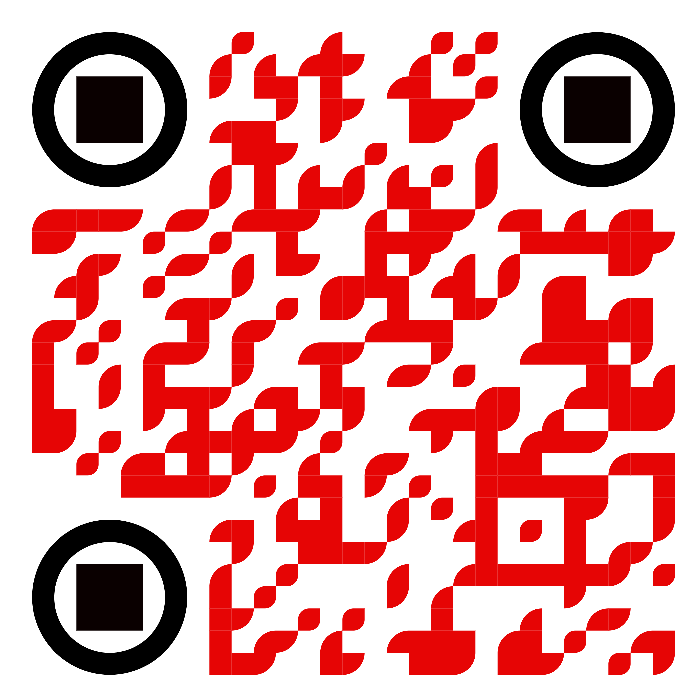
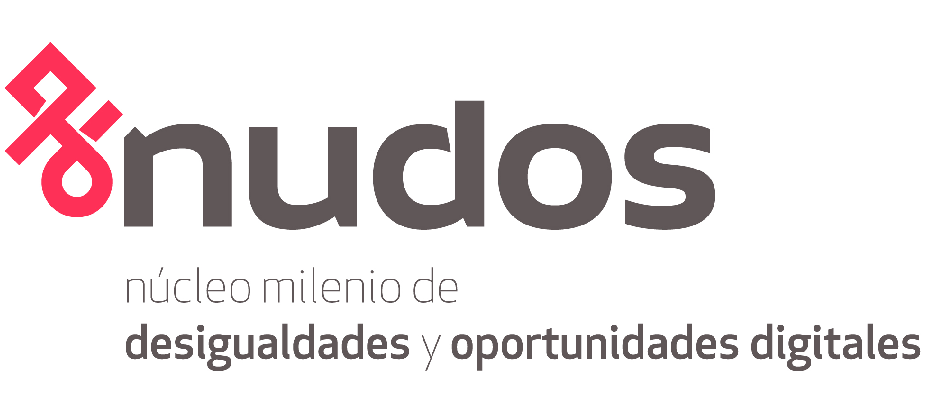
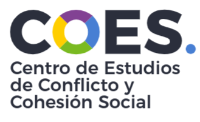

class: front middle center

```{r eval=FALSE, include=FALSE}
# Correr esto para que funcione el infinite moonreader, el root folder debe ser static para si dirigir solo "bajndo" en directorios hacia el bib y otros

xaringan::inf_mr('/static/docpres/02_bases/2mlmbases.Rmd')

o en RStudio:
  - abrir desde carpeta root del proyecto
  - Addins-> infinite moon reader
```


```{r setup, include=FALSE, cache = FALSE}
require("knitr") 
options(htmltools.dir.version = FALSE)
pacman::p_load(RefManageR)
# bib <- ReadBib("../../bib/electivomultinivel.bib", check = FALSE)
opts_chunk$set(warning=FALSE,
             message=FALSE,
             echo=FALSE,
             cache = FALSE, fig.width=7, fig.height=5.2)
pacman::p_load(flipbookr, tidyverse)
```


```{r xaringanExtra, echo=FALSE}
xaringanExtra::use_xaringan_extra(c("tile_view", "animate_css"))
xaringanExtra::use_progress_bar(color = "red", location = "top")

# xaringanExtra::use_share_again()
# xaringanExtra::use_scribble()
```

<!---
About macros.js: permite escalar las imágenes como [scale 50%](path to image), hay si que grabar ese archivo js en el directorio.
--->


.pull-left-narrow[

.left[
 

----
 



----

.small[**Congreso Chileno de Sociología**

2-4 Mayo 2024]

]
]

.pull-right-wide[

.right[
.content-box-gray[


## **.red[Barreras para la Ciencia Abierta en la investigación en Ciencias Sociales en Chile]**

]

**.red[Juan Carlos Castillo, Cristóbal Ortiz, Kevin Carrasco, Moira Martínez & Valentina Frometa]** 
.small[
Departamento de Sociología, Universidad de Chile]
.small[[.red[jc-castillo.com]](https://jc-castillo.com/)

]
]
]


---

layout: true
class: animated, fadeIn

---
class: middle

----
.pull-left[
]

.pull-right[

#### El .red[Laboratorio de Investigación Social Abierta (LISA)] tiene por objetivo ofrecer herramientas y orientaciones para la apertura científica de las distintas etapas de los proyectos de investigación en ciencias sociales.
]

<br>
.center[
.content-box-red[
# [.red[lisa-coes.com]](https://lisa-coes.com/)]
]

---
class: middle
.content-box-red[
### Ciencia abierta y flujo de investigación]
 

---
## ¿Qué porcentaje de los estudios publicados son reproducibles?

.pull-left-wide[

]
.pull-right-narrow[
<br>
<br>
<br>
<br>
<br>
<br>
... alrededor de un **40%!** (... varía por disciplina)
]

---
class: center


.small[
Fuente: [Baker (2016) 1,500 scientists lift the lid on reproducibility - Nature](https://www.nature.com/news/1-500-scientists-lift-the-lid-on-reproducibility-1.19970)]

---
class: roja bottom

# Este estudio
<br>

---
## Este estudio

* Muestreo:

* Módulos:
  - Ciencia abierta
  - Acceso abierto a publicaciones
  - Diseño transparente
  - Datos abiertos
  - Investigación reproducible
  
* FormR
  
* Link a encuesta: 
---
# Datos

* Encuesta aplicada desde a la fecha

* 70 respuestas completas

* ...

* [Tabla descriptiva de variables]

---
class: roja bottom


.pull-right[
.right[
# Resultados

### Conocimientos
### Prácticas
### Valoración

<br>]
]

---
class: roja bottom


.pull-right[
.right[
# Resultados

### **.yellow[Conocimientos**]
### Prácticas
### Valoración

<br>]
]

---


---


---


---


---


---


---
class: roja bottom


.pull-right[
.right[
# Resultados

### Conocimientos
### **.yellow[Prácticas**]
### Valoración

<br>]
]

---


---


---


---


---
class: roja bottom


.pull-right[
.right[
# Resultados

### Conocimientos
### Prácticas
### **.yellow[Valoración**]

<br>]
]


---


---


---


---


---


---


---
class: inverse

## Conclusiones

####- Conocimiento variable y heterogéneo según áreas de la ciencia abierta y grupos específicos

#### - Bajo nivel de prácticas, particularmente las identificadas en la comunidad (vs las própias)

####- Alta valoración, principalmente generaciones más jóvenes, carrera inicial y mujeres

---
class: middle center


# ¡Gracias por su atención!

Más info:

[lisa-coes.com](https://lisa-coes.com/)

[](https://github.com/lisa-coes/)

---


.pull-left-narrow[

.left[
 

----
 


----
class: front middle center 

.small[**Congreso Chileno de Sociología**

2-4 Mayo 2024]

]
]

.pull-right-wide[

.right[
.content-box-gray[


## **.red[Barreras para la Ciencia Abierta en la investigación en Ciencias Sociales en Chile]**

]

**.red[Juan Carlos Castillo, Cristóbal Ortiz, Kevin Carrasco, Moira Martínez & Valentina Frometa]** 
.small[
Departamento de Sociología, Universidad de Chile]
.small[[.red[jc-castillo.com]](https://jc-castillo.com/)

]
]
]

