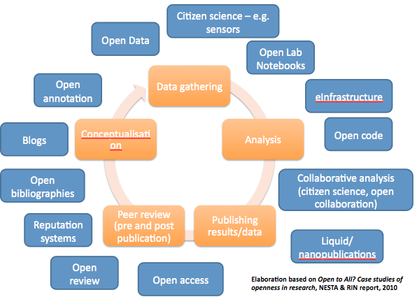
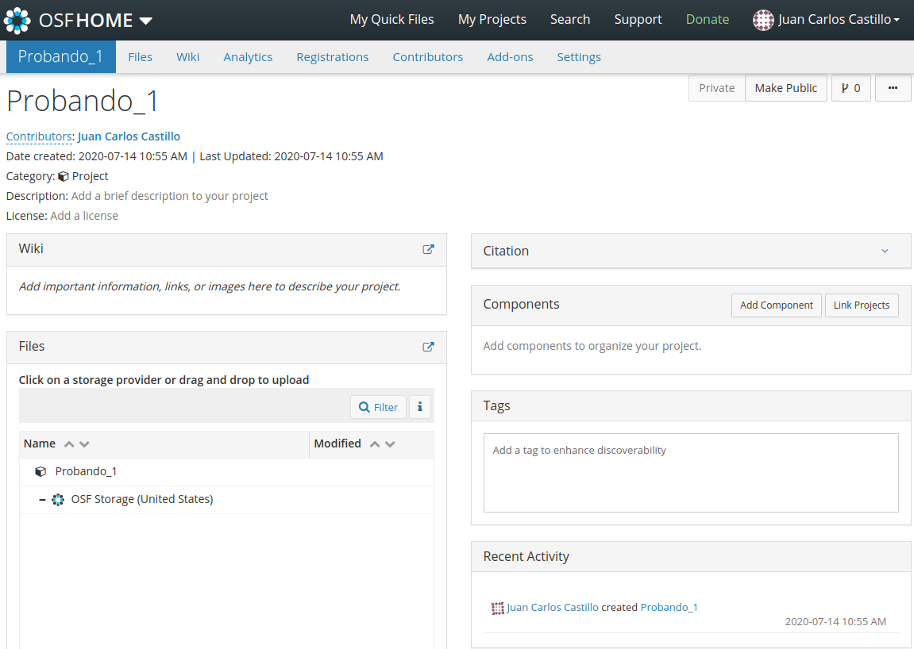
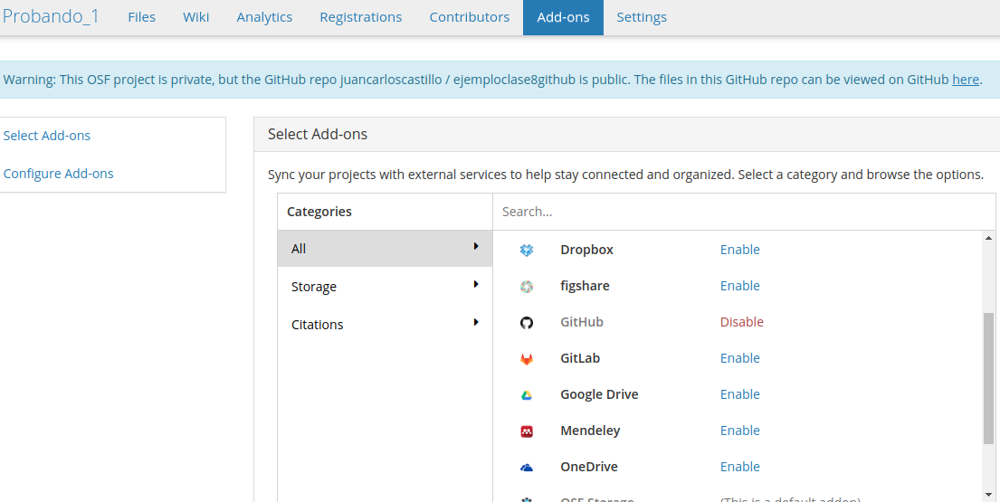
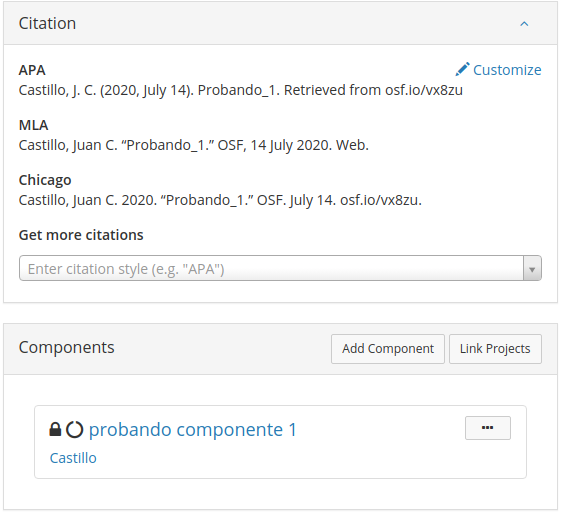

class: front


```{r eval=FALSE, include=FALSE}
# Para que funcione el infinite moon reader, correr desde el root!
```

```{r setup, include=FALSE, cache = FALSE}
require("knitr")
options(htmltools.dir.version = FALSE)
pacman::p_load(RefManageR)
# bib <- ReadBib("../../bib/electivomultinivel.bib", check = FALSE)
opts_chunk$set(warning=FALSE,
             message=FALSE,
             echo=TRUE,
             cache = TRUE,fig.width=7, fig.height=5.2)
```

<!---
Para correr en ATOM
- open terminal, abrir R (simplemente, R y enter)
- rmarkdown::render('static/docpres/07_interacciones/7interacciones.Rmd', 'xaringan::moon_reader')

About macros.js: permite escalar las imágenes como [scale 50%](path to image), hay si que grabar ese archivo js en el directorio.
--->


.pull-left[
# Ciencia Social Abierta
## cienciasocialabierta.netlify.app
----
## Juan Carlos Castillo
## Sociología FACSO - UChile
## 1er Sem 2020
]


.pull-right[
.right[

]

## Sesión 9: *Proyectos abiertos: OSF*
]

---

layout: true
class: animated, fadeIn

---

.center[]


---
# Hasta ahora: Bases reproducibilidad

- Escritura abierta:

  - Markdown / RMarkdown
  - Citas en lenguaje abierto (Bibtex vía Zotero)

- Flujo reproducible: Protocolo (IPO)

- Versionamiento: Git / Github

---
class: inverse middle center

# La **reproducibilidad** es la base para un proceso de mayor apertura de la investigación científica a la comunidad 

---
# Abriendo mi proyecto

- En general, podemos acceder solo al **resultado** de un proyecto, usualmente un artículo

--

- Abriendo resultados: Academia.edu, Researchgate, SSRN, scienceopen ...

--

- ¿Es posible lograr apertura en las **distintas fases** del proceso de investigación?


---

.center[]

---


- El **Open Science Framework** es una plataforma web orientada a facilitar la apertura de los proyectos de investigación en sus distintas fases

- Permite la conexión con distintas herramientas y aplicaciones

---

.center[]

---

.center[]

---

# Funcionamiento básico OSF

- Proyectos de investigación: es básicamente una carpeta abierta de proyecto, con funciones adicionales 

- Para ello:

  - (abrir cuenta, gratuito)

  - generar un proyecto nuevo

  - agregar archivos (... o sincronizar con servicios como Drive, Dropbox o Github)

---


---
# Crear un nuevo proyecto


---
# Crear nuevo proyecto


---
## Vista de proyecto

---
# Privacidad

- por defecto, los repositorios se crean como privados

- para hacer públicos: -> _Make public_

---


- Files: carpetas/archivos del proyecto. 

- Wiki: información general sobre el proyecto

- Registrations: pre-registros

- Contributors: agregar colaboradores

- Add-ons: vincular aplicaciones

- Settings: opciones generales

---
.pull-left-narrow[

# Add-ons

Permiten vincular repositorios, carpetas/archivos que luego estarán disponibles en _Files_

]

<br>
.pull-right-wide[



]

---
.pull-left-narrow[
# Otras ventanas

.medium[
- **Citation**: para citar el proyecto (al ser creado ya es citable)

- **Components**: Son proyectos dentro de un proyecto mayor. Pueden tener los mismos colaboradores o no.]
]

.pull-right-wide[
.right[

]]

---
# Resumen

- En general se piensa la apertura (access) como la disponibilidad del artículo final

- Un estándar de apertura mayor consiste en abrir las distintas etapas del proceso de investigación

- La apertura del ciclo completo de investigación se facilita usando plataformas como el OSF.

---
class: front


.pull-left[
# Ciencia Social Abierta
## cienciasocialabierta.netlify.com
----
## Juan Carlos Castillo
## Sociología FACSO - UChile
## 1er Sem 2020
]


.pull-right[
.right[

]


]
