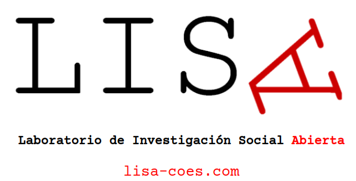
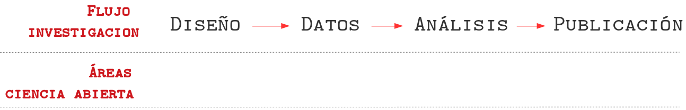
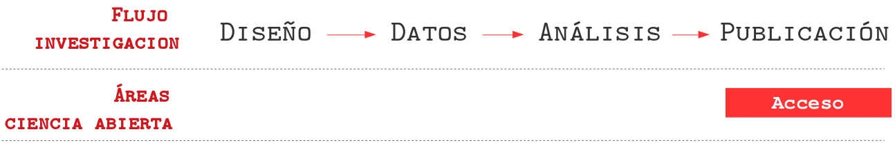
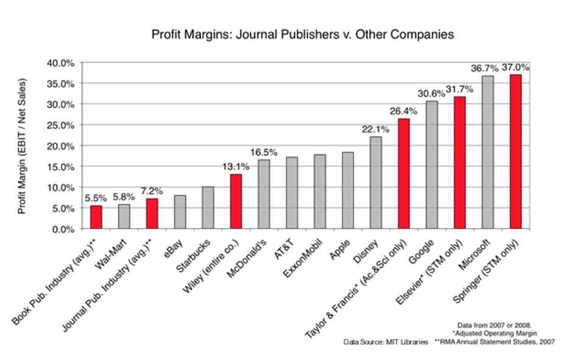
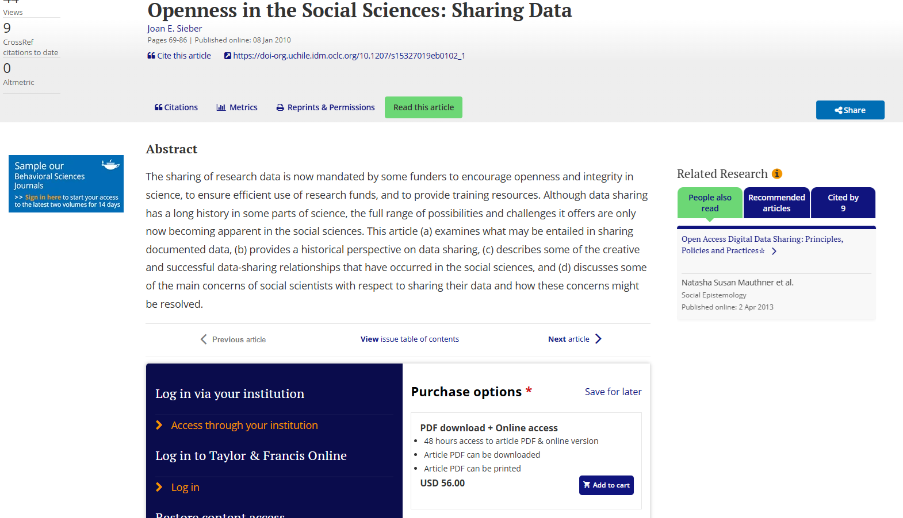
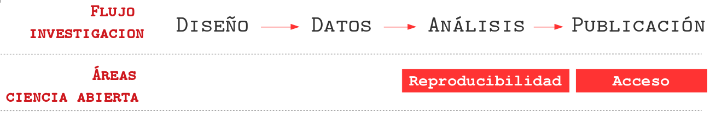
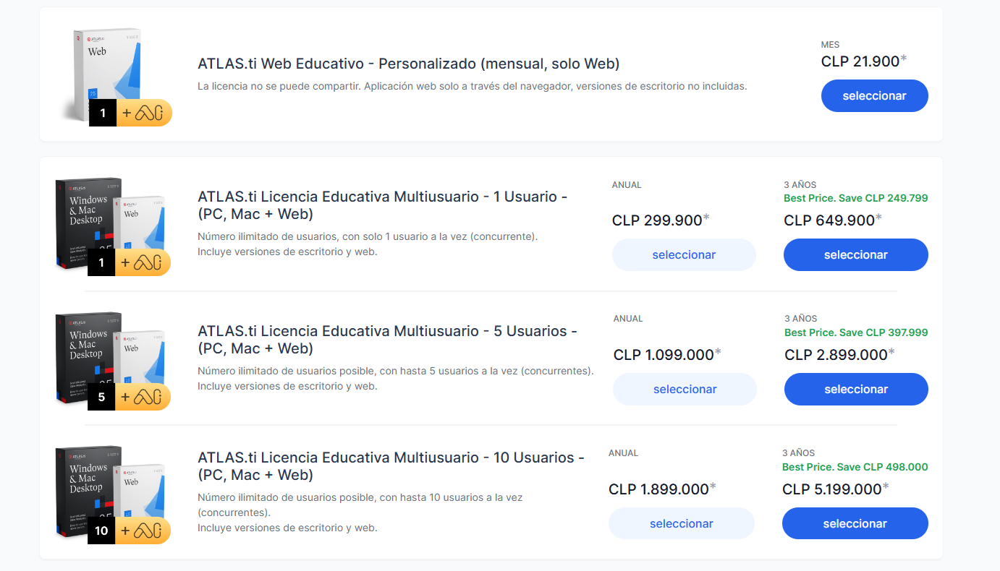
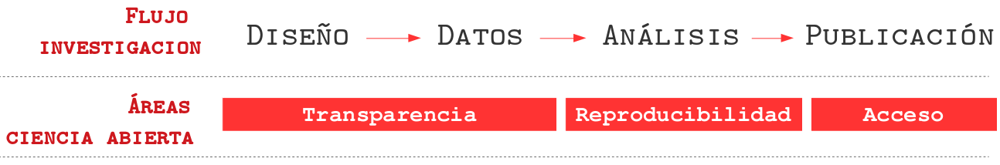
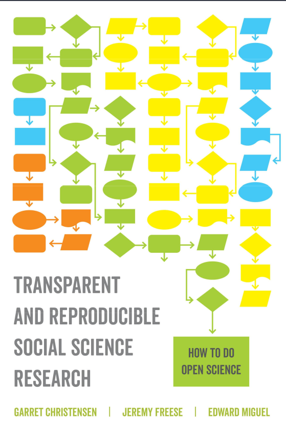

class: front middle center

```{r eval=FALSE, include=FALSE}
# Correr esto para que funcione el infinite moonreader, el root folder debe ser static para si dirigir solo "bajndo" en directorios hacia el bib y otros

xaringan::inf_mr('/static/docpres/02_bases/2mlmbases.Rmd')

o en RStudio:
  - abrir desde carpeta root del proyecto
  - Addins-> infinite moon reader
```


```{r setup, include=FALSE, cache = FALSE}
require("knitr")
options(htmltools.dir.version = FALSE)
pacman::p_load(RefManageR)
# bib <- ReadBib("../../bib/electivomultinivel.bib", check = FALSE)
opts_chunk$set(warning=FALSE,
             message=FALSE,
             echo=FALSE,
             cache = FALSE, fig.width=7, fig.height=5.2)
pacman::p_load(flipbookr, tidyverse)
```


```{r xaringanExtra, echo=FALSE}
xaringanExtra::use_xaringan_extra(c("tile_view", "animate_css"))
xaringanExtra::use_progress_bar(color = "red", location = "top")

# xaringanExtra::use_share_again()
# xaringanExtra::use_scribble()
```

<!---
About macros.js: permite escalar las imágenes como [scale 50%](path to image), hay si que grabar ese archivo js en el directorio.
--->

.pull-left-narrow[

.left[

 

 



.small[Universidad de Chile

Martes 1 de Abril 2025]

]
]

.pull-right-wide[

.right[
.content-box-gray[


# **.red[Introducción a la Ciencia Abierta]**

----

#### Acceso, reproducibilidad y transparencia en la investigación social


]

### **.red[Kevin Carrasco]** 
.small[
Departamento de Sociología - COES, Universidad de Chile]
.small[[.red[jc-castillo.com]](https://jc-castillo.com/)

]
]
]


---

layout: true
class: animated, fadeIn

---
class: middle

.pull-left[


]
.pull-right[

#### El .red[Laboratorio de Investigación Social Abierta (LISA)] tiene por objetivo ofrecer herramientas y orientaciones para la apertura científica de las distintas etapas de los proyectos de investigación en ciencias sociales.
]

<br>
.center[
.content-box-red[
# [.red[lisa-coes.com]](https://lisa-coes.com/)]
]

---

layout: true
class: animated, fadeIn

---
class: inverse
.right[
# **.orange[Programa]**
]
<br>
## A. Acceso

## B. Reproducibilidad

## C. Transparencia

---
class: inverse
.right[
# **.orange[Programa]**
]
<br>
## A. **.yellow[Acceso]**

## B. Reproducibilidad

## C. Transparencia

---
class: roja, middle, right


# ¿Existe una crisis de apertura en la ciencia?

---
<br>


---
<br>
 


---
class: middle, center

.pull-left[
<br>
<br>
<br>
<br>
# Barreras de pago
]
.pull-right[
.left[

]
]

---
# Márgenes de ganancia

.center[

]

---
.pull-left-narrow[
<br>

]

.pull-right-wide[

### Modelo actual de publicación científica:
- las vacas hacen leche (se ordeñan solas)

- otras vacas revisan la leche (gratis)

- las vacas le pagan al granjero para distribuir la leche

- luego el granjero le vende la leche de vuelta a las vacas
]

---

### Paradojas en el acceso

.center[

]

---

### Actualmente...

- En general, podemos acceder solo al **resultado** de un proyecto, usualmente un artículo

--

- Abriendo resultados: Academia.edu, Researchgate, SSRN, scienceopen ... y otros no legales

--

- Documental "Paywall: The Business of Scholarship" [Youtube](https://www.youtube.com/watch?v=HM_nWsdbNvQ&ab_channel=JasonSchmitt)

--

- ¿Es posible lograr apertura en las **distintas fases** del proceso de investigación?

---
class: inverse
.right[
# **.orange[Programa]**
]
<br>
## A. Acceso

## B. **.yellow[Reproducibilidad]**

## C. Transparencia


---
<br>
 



--

- Es la capacidad de **regenerar** de manera independiente los resultados de una investigación usando los materiales originales de una investigación ya publicada.

--

- En términos simples: obtener los mismos resultados de una investigación utilizando los mismos datos.

---
## ¿Qué porcentaje de los estudios publicados son reproducibles?

.pull-left-wide[

]
.pull-right-narrow[
<br>
<br>
<br>
<br>
<br>
<br>
... alrededor de un **40%!** (... varía por disciplina)
]

---
class: center


.small[
Fuente: [Baker (2016) 1,500 scientists lift the lid on reproducibility - Nature](https://www.nature.com/news/1-500-scientists-lift-the-lid-on-reproducibility-1.19970)]

---
class: center middle


.small[
Fuente: [Baker (2016) 1,500 scientists lift the lid on reproducibility - Nature](https://www.nature.com/news/1-500-scientists-lift-the-lid-on-reproducibility-1.19970)]

---

### ¿y en la práctica cómo afecta la reproducibilidad?

.pull-left[


]

.pull-right[

- Breznau, et. al, (2023) coordinó una investigación con 161 investigadores de 73 equipos de investigación.

- Los equipos informaron tanto hallazgos numéricos como conclusiones sustanciales muy diversas

]

---
### ¿Qué factores influyen en la reproducibilidad?

.pull-left[


]

.pull-right[


]


---

## Flujo de trabajo con procesador de texto tradicional

.center[

]

---
## Abriendo el archivo de escritura tradicional


---
## Desventajas del procesador tradicional

.pull-left-wide[
.medium[

- Barrera de **pago/licencia** para acceder a contenidos (propiedad)

- Difícil **versionamiento** y llevar registro de quién hizo qué cambio, barrera a la reproducibilidad y colaboración 

- No permite un documento enteramente **reproducible** que combine texto y código de análisis (en caso de utilizarlo) ]
]

.pull-right-narrow[
<br>
<br>

]

---
.pull-left-narrow[
## Escritura libre y abierta
]

<br>
.pull-right-wide[
.content-box-red[
- independiente de programa comercial

- independiente de plataformas específicas

- permite combinar texto y análisis en un mismo documento

- foco en los contenidos en lugar del formato

- permite distintas opciones de formato final]]

---
# Inspiración

.center[
]

---

.pull-left-narrow[
## Escritura simple / plana
]

.pull-right-wide[
<br>
.content-box-red[
- entorno: editor de texto

- separación entre texto de entrada (input) y texto de salida (output)

- foco en el input/contenido vs output/formato

- marcas de edición: vínculo entre formato de input y output

- sin cortar / pegar
 ]
]

---

## Principales Alternativas

.left-column[
## **Latex**

## .grey[Markdown]
]

.right-column[

- sistema de escritura simple de amplio uso en la academia

- alta calidad en salida a pdf

- creado a comienzos de los 80 (Donald Knuth, Leslie Lamport)


]

---
## Principales Alternativas

.left-column[
## **Latex**

## .grey[Markdown]
]

.right-column[


]

---

### y con Atlas.ti?



---
class: inverse
.right[
# **.orange[Programa]**
]
<br>
## A. Acceso

## B. Reproducibilidad

## C. **.yellow[Transparencia]**

---
<br>
 



---
### Prácticas cuestionables de investigación

##### El caso de Pedro

- Pedro accede una base de datos con información sobre trabajadores sindicalizados en distintas empresas del país. 

--

- .bold[Sin tener una hipótesis previa], correlaciona  las variables: .green[participación en huelga] (1), .red[tiempo de afiliación sindical] (2) y .orange[tipo de contrato] (3)

--

- Observa que hay una correlación positiva entre tiempo sindicalizado y participación en huelgas (_r_ = 0,32)

--

- Posterior a mirar los datos establece una hipótesis: a mayor .red[tiempo de afiliación sindical] (x) existe mayor .green[participación en huelgas] (y)

---

- .red[No encuentra] resultados esperados en base a su hipótesis (tiempo de afiliación sindical impacta positivamente en la participación en huelgas)

--

- Ajusta la variable tiempo, .bold[eliminando casos] que llevan .red[menos de 2 años sindicalizados en la empresa], obteniendo una asociación significativa con probabilidad de error _p_ <0.05

--

- Finalmente .bold[excluye] a trabajadores a .orange[plazo fijo], manteniendo solo aquellos con contrato indefinido, obteniendo un _p_ <0.01

# .center[🤔?]
---

class: middle

las .red[prácticas cuestionables de investigación] refieren a las:

>  _"acciones que violan los valores tradicionales de la empresa de investigación y que pueden ser perjudiciales para el proceso de investigación"_ (National Academies of Science 1992 en Steneck, 2006, p. 58).

---
# Algunas consecuencias

- el problema *no es la exploración de datos*, sino su uso en reporte selectivo de resultados de investigación

--

- incrementa la posibilidad de rechazar erróneamente $H_0$

--

- exageraciones de efectos estimados, perjudicando la replicabilidad

--

- se confirma lo que uno está buscando, no lo que entregan los datos (y pierde sentido el recolectar datos, y hacer investigación empírica)

---
class: middle

## pre-registro

_Un .bolder[pre-registro] es una marca .red[temporal] que busca dar cuenta del diseño de una investigación: .orange[(1) principales hipótesis], .orange[(2) recolección de datos] y .orange[(3) plan de análisis.]_


---
# Características de un pre-registro

- se crea un registro permanente y disponible del plan del estudio .orange[antes de mirar los datos]

- establece una fecha de publicación

- accesible y con opción de resguardo de anonimato de autores (p.ej. OSF)

- .bold[objetivo principal:] diferenciar aspectos especificados a priori (hipótesis y análisis) de aquellos más exploratorios 


---
# Ventajas de pre-registros

.pull-left[
- transparencia del diseño

- eficiencia en el análisis

- mantener el foco en la .bold[teoría]

- .red[no impide explorar], solo diferenciar .orange[intuiciones exploratorias] de .green[ hipótesis confirmatorias]]

- .bold[Encontrable]: se genera un .blue[.bold[DOI]] que permite citar

- Puede evitar conflictos por co-autorias

- Evitar situaciones de plagio 

.pull-right[
.center[

]
]

---

#  Importancia de las hipótesis confirmatorias

--

* la evidencia previa e hipótesis guiadas por teoría:
--
  
  * permite delimitar correctamente el .orange[fenómeno a explicar] (_explanandum_) y
  
  * establecer cuál(es) conceptos/variables lo explican (_explanans_)
  
  * la .red[discusión] de resultados abre el camino para investigaciones posteriores

---


- El **Open Science Framework** es una plataforma web orientada a facilitar la apertura de los proyectos de investigación en sus distintas fases

- Permite la conexión con distintas herramientas y aplicaciones

---

.center[]

---

.center[]

---

# Funcionamiento básico OSF

- Proyectos de investigación: es básicamente una carpeta abierta de proyecto, con funciones adicionales 

- Para ello:

  - (abrir cuenta, gratuito)

  - generar un proyecto nuevo

  - agregar archivos (... o sincronizar con servicios como Drive, Dropbox o Github)

---
class: middle center


### Clasificación alimentarias

---
### Open data

- Repositorios

- Iniciativas institucionales

- Cuestiones éticas

---
<br>
 


---
class: middle center



---
class: middle center
Más info:

#lisa-coes.com


---
class: front center
.right[

]


### .medium[**.black[Laboratorio de Investigación Social] .red[Abierta]]**


### [.red[lisa-coes.com]](https://lisa-coes.com/) 


  