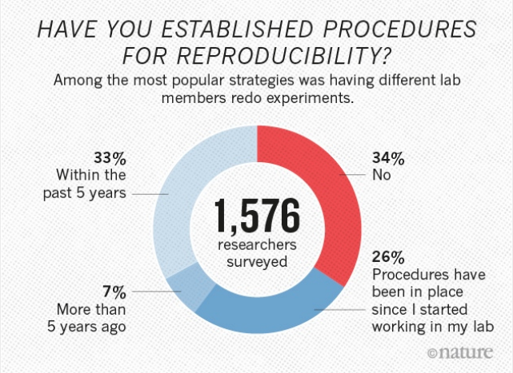

class: front middle center

```{r eval=FALSE, include=FALSE}
# Correr esto para que funcione el infinite moonreader, el root folder debe ser static para si dirigir solo "bajndo" en directorios hacia el bib y otros

xaringan::inf_mr('/static/docpres/02_bases/2mlmbases.Rmd')

o en RStudio:
  - abrir desde carpeta root del proyecto
  - Addins-> infinite moon reader
```


```{r setup, include=FALSE, cache = FALSE}
require("knitr") 
options(htmltools.dir.version = FALSE)
pacman::p_load(RefManageR)
# bib <- ReadBib("../../bib/electivomultinivel.bib", check = FALSE)
opts_chunk$set(warning=FALSE,
             message=FALSE,
             echo=FALSE,
             cache = FALSE, fig.width=7, fig.height=5.2)
pacman::p_load(flipbookr, tidyverse)
```


```{r xaringanExtra, echo=FALSE}
xaringanExtra::use_xaringan_extra(c("tile_view", "animate_css"))
xaringanExtra::use_progress_bar(color = "red", location = "top")

# xaringanExtra::use_share_again()
# xaringanExtra::use_scribble()
```

<!---
About macros.js: permite escalar las imágenes como [scale 50%](path to image), hay si que grabar ese archivo js en el directorio.
--->

.pull-left-narrow[

.left[

 


 .white[..]


]
]

.pull-right-wide[

.right[
.content-box-red[
 ## **.red[Reproducibilidad y repositorios de investigación abiertos]**
----


**.gray[Juan Carlos Castillo]** 
.small[
Departamento de Sociología - COES, Universidad de Chile]
.small[[.blue[jc-castillo.com]](https://jc-castillo.com/)

]
]
.left[.small[08 Junio 2023 - online]]
]
]


---

layout: true
class: animated, fadeIn

---
class: middle

.pull-left[
]

.pull-right[

#### El .red[Laboratorio de Investigación Social Abierta (LISA)] tiene por objetivo ofrecer herramientas y orientaciones para la apertura científica de las distintas etapas de los proyectos de investigación en ciencias sociales.
]
---

class: middle

 


---
class: roja right middle

# Contenidos

## 1. Reproducibilidad
## 2. Proyectos reproducibles
## 3. Versionamiento y repositorios

---
class: roja right middle

# Contenidos

## 1. **.yellow[Reproducibilidad]**
## 2. Proyectos reproducibles
## 3. Versionamiento y repositorios


---
class: center 

---
class: inverse center

## ¿Cómo organizamos el trabajo de investigación (en el momento del análisis y escritura)?

--
<br>

----

## ¿Qué precauciones tomamos en términos de .yellow[reproducibilidad]?

???

mano alzada, flinga
relacionar:
Diseño: estructura
Gestión: Flujo

Lámina final final final.docx

Vamos a partir por estructura: protocolo
Luego con herramientasque ayudan a una gestion abierta del proyecto
Texto plano / Markdown - Bibtex
Github
lamina de herramientas flujo ciencia abierta, enfatizar el concepto de reproducibilidad, Bowers


---
class: middle center 


---
## ¿Qué porcentaje de los estudios publicados son reproducibles?

.pull-left-wide[

]
.pull-right-narrow[
<br>
<br>
<br>
<br>
<br>
<br>
... alrededor de un **40%!** (... varía por disciplina)
]

---
class: center


.small[
Fuente: [Baker (2016) 1,500 scientists lift the lid on reproducibility - Nature](https://www.nature.com/news/1-500-scientists-lift-the-lid-on-reproducibility-1.19970)]

---
class: center middle



.small[
Fuente: [Baker (2016) 1,500 scientists lift the lid on reproducibility - Nature](https://www.nature.com/news/1-500-scientists-lift-the-lid-on-reproducibility-1.19970)]


---
class: middle 

.pull-left-wide[

]

.tiny[
.pull-right-narrow[
[Knudtson, K. L., et al (2019). Survey on Scientific Shared Resource Rigor and Reproducibility. Journal of Biomolecular Techniques : JBT, 30(3), 36–44. https://doi.org/10.7171/jbt.19-3003-001
](https://pubmed.ncbi.nlm.nih.gov/31452645/)
]
]

---
class: center 
.pull-left[
]

--


---
class: middle, center


---
class: roja right middle

# Contenidos

## 1. Reproducibilidad
## 2. **.yellow[Proyectos reproducibles]**
## 3. Versionamiento y repositorios


---
class: middle 

.pull-left[
# **.red[Proyectos reproducibles]**
]
.pull-right[
.content-box-red[
<br>
### a. Texto plano

### b. Carpetas y archivos

### c. Autocontención
<br>
<br>
]]

---
class: middle 

.pull-left[
# **.red[Proyectos reproducibles]**
]
.pull-right[
.content-box-red[
<br>
### a. **Texto plano**

### b. Carpetas y archivos

### c. Autocontención
<br>
<br>
]]

---
## Flujo de trabajo con procesador de texto tradicional

.center[

]

---
## Abriendo el archivo de escritura tradicional


---
## Desventajas del procesador tradicional

.pull-left-wide[


- Barrera de **pago/licencia** para acceder a contenidos (propiedad)

- Difícil **versionamiento** y llevar registro de quién hizo qué cambio, barrera a la reproducibilidad y colaboración 

- No permite un documento enteramente **reproducible** que combine texto y código de análisis (en caso de utilizarlo) ]


.pull-right-narrow[
<br>
<br>


]


---
.pull-left-narrow[
## Escritura libre y abierta
]

<br>
.pull-right-wide[
.content-box-red[
- independiente de programa comercial

- independiente de plataformas específicas

- permite combinar texto y análisis en un mismo documento

- foco en los contenidos en lugar del formato

- permite distintas opciones de formato final]]

---
# Inspiración

.center[
]

---

.pull-left-narrow[
## Escritura simple / plana
]

.pull-right-wide[
<br>
.content-box-red[
- entorno: editor de texto

- separación entre texto de entrada (input) y texto de salida (output)

- foco en el input/contenido vs output/formato

- marcas de edición: vínculo entre formato de input y output

- sin cortar / pegar
 ]
]
---
## Marcas de edición

- Vínculo entre escritura en texto simple (input) y output


---
## Principales Alternativas

.left-column[
## **Latex**

## .grey[Markdown]
]

.right-column[

- sistema de escritura simple de amplio uso en la academia

- alta calidad en salida a pdf

- creado a comienzos de los 80 (Donald Knuth, Leslie Lamport)


]

---
## Principales Alternativas

.left-column[
## **Latex**

## .grey[Markdown]
]

.right-column[


]

---
## Principales Alternativas

.left-column[
## .grey[Latex]

## **Markdown**
]

.right-column[

.medium[
- creado por John Gruber y Aaron Swartz en 2004

- forma de escritura simple con pocas marcas de formato

- conversión a distintos formatos de salida (html, pdf)

- Soporta encabezados, tablas, imágenes, tablas de contenidos, ecuaciones, links ...

- filosofía: foco en contenido primero, el formato después.
]

]


---
## Principales Alternativas

.left-column[
## .grey[Latex]

## **Markdown**
]

.right-column[
.right[
]
]

---
## Principales Alternativas

.left-column[
## .grey[Latex]

## **Markdown**
]
.right-column[
.right[
 
]]


---
## Principales Alternativas

<br>


|          	| **Control de formato** 	| **Marcas de edición** 	| **Formatos de salida** 	|
|----------	|:--------------------:|:----------------:|:--------------------:|
| LaTeX    	|          +         	|        +       	|          -         	|
| Markdown 	|          -         	|        -       	|          +         	|

---

## Markdown, pandoc y renderización


---
## Ejemplos de marcas de edición en Markdown

.content-box-red[
- Texto en **negrita** entre dos astericos: `**negrita**`

- Texto en *cursiva* con un asterico por lado: ` *cursiva*`

- Títulos se marcan con `#` al principio, subtítulos `##` , y así sucesivamente

- Imágenes: ``

- Links: `[](link-web)`]


---

# Recursos

## - [Tutorial de markdown online](https://www.markdowntutorial.com/es/)

## - [Markdown cheatsheet](https://www.markdownguide.org/cheat-sheet/)


---
class: middle 

.pull-left[
# **.red[Proyectos reproducibles]**
]
.pull-right[
.content-box-red[
<br>
### a. Texto plano

### b. **Carpetas y archivos**

### c. Autocontención
<br>
<br>
]]


---
## Alternativas
.pull-left[
.content-box-red[
### .red[A. ad-hoc ]
  - cada investigador define numero de archivos, nombres, carpetas y organización
  
  - explicar al resto cómo se organiza
  - documentar en un archivo cómo se organiza
  
.right[--> reproducibilidad y transparencia **LIMITADA**]  
]]

--
.pull-right[
.content-box-green[
### .red[B. *Protocolo* reproducible]

  - **estructura** de carpetas y archivos interconectados que refieren a reglas conocidas (estándares)
  
  - **autocontenido**: toda la información necesaria para la reproducibilidad se encuentra en la carpeta raíz o directorio de trabajo.]
]
---
# .right[... estándares]

.center[

]

---

.pull-left-narrow[
## Ejemplo protocolo reproducible: [TIER](https://www.projecttier.org/)]
.pull-right-wide[
<br>
.center[

]
]
---
.pull-left-narrow[
## Ejemplo protocolo reproducible: [TIER](https://www.projecttier.org/)]
.pull-right-wide[
<br>
.center[

]
]


---
.center[

]

---
## Estructura IPO


---
class: middle center

## Mayores detalles y plantilla de carpetas:

<br>
.center[

## [https://lisa-coes.com/ipo-repro/](https://lisa-coes.com/ipo-repro/)

## [https://github.com/lisa-coes/ipo](https://lisa-coes.com/ipo-repro/)

]

---
class: middle 

.pull-left[
# **.red[Proyectos reproducibles]**
]
.pull-right[
.content-box-red[
<br>
### a. Texto plano

### b. Carpetas y archivos

### c. **Autocontención**
<br>
<br>
]]


---
# Carpeta autocontenida

- proyecto **autocontenido**: reproducible sin necesidad de archivos externos

- requisito: establecer **directorio de trabajo**

  - posición de referencia de todas las operaciones al interior del proyecto
  
  - también llamado **directorio raíz**
  
---
## Directorio de trabajo

- ej. forma tradicional en hoja de código R: 

  - `setwd(ruta-a-carpeta-de-proyecto)`

  - problemas: hace referencia a ruta local en el computador donde se está trabajando, por lo tanto no es reproducible y **se debe evitar**
  
- alternativa sugerida en R: **RStudio Projects**  

---
# RStudio Projects

.content-box-red[
- La funcionalidad **Projects** de RStudio permite establecer claramente un directorio de trabajo de manera eficiente

- Para ello, genera un archivo de extensión **.Rproj** en el directorio raiz de la carpeta del proyecto

- Luego se facilita acceder a la carpeta del proyecto en RStudio ejecutando desde el administrador de archivos del computador (file manager) el archivo **.Rproj** 

- para comprobar, ejecutar `getwd()` y debería dar la ruta hacia la carpeta del proyecto
]
---
.pull-left[
## RStudio Projects
- File -> New Project


]

.pull-right[
<br>
<br>
<br>
<br>


]

---
## RStudio Projects

.center[

]

---
## Abriendo la sesión de RStudio como proyecto

<br>
- identificar en la carpeta respectiva el archivo .Rproj

- ejecutar y se abre R / RStudio desde ese directorio como raíz


---
## Rutas relativas en código

- forma de "señalar el camino" para abrir y guardar archivos al interior de una carpeta de proyecto autocontenido (= sin referencias locales)

- este camino tiene básicamente 3 direcciones:

  - bajar -> hacia subcarpetas
  
  - subir -> hacia carpetas superiores
  
  - subir y bajar -> hacia otras subcarpetas 

---
## Rutas relativas: bajando

- para **"bajar"** hacia a una subcarpeta, simplemente damos la ruta de la carpeta/archivo

  - ej: si estoy en el archivo paper.Rmd (directorio raíz), y quiero incluir una imagen (directorio input/images/imagen.jpg), entonces la ruta es `input/images/imagen.jpg`
  
  - o para señalar la ruta al bib desde paper.Rmd (en raíz): `input/bib/referencias.bib`

---
## Rutas relativas: subiendo

- para **subir** se utilizan los caracteres `../` por cada nivel.

- Ej: si quiero guardar una tabla en el directorio raíz generada desde un archivo de código en la subcarpeta proc, entonces la ruta es `../tabla.html`

---
## Rutas relativas: subiendo y bajando 

- combinación de las anteriores

- Ej: para abrir la base de datos original en la subcarpeta input/data desde el código de procesamiento en la subcarpeta proc, entonces:

`../input/data/original.dat`


---
class: roja right middle

# Contenidos

## 1. Reproducibilidad
## 2. Proyectos reproducibles
## 3. **.yellow[Versionamiento y repositorios]**


---
class: inverse

.pull-left[
.center[

]
]

--

.pull-right[
<br>
<br>
<br>
### ¿Cómo registrar de manera eficiente quién hizo qué y cuando en un archivo/documento?
]

---
class: roja middle center

## .yellow[La escritura en texto simple (como Markdown) permite implementar un sistema de control de versiones, además de herramientas de respaldo, colaboración y comunicación]

---
## El origen: Abriendo un sistema operativo

.pull-left[
<br>

]


.pull-right[
- Linus Torvalds, 1991 (21 años)

- Crea sistema operativo libre (**Linux**) y lo abre a la colaboración. Postea:

  - "I'm doing a (free) operating system (just a hobby, won't be big and professional..."

]
---
## Desarrollo del Linux Kernel


.pull-left[
<br>
<br>

]

.pull-right[
<br>

- version 1: 1994

- version 5: 2019

- Más de 11 mil colaboradores

- mas de 30 millones de líneas de código

- **¿versionamiento?**

]

---
##... más sobre Linux, Torvalds y código abierto 


Linus Torvalds TED Talk 

[https://www.youtube.com/watch?v=o8NPllzkFhE&t=156s](https://www.youtube.com/watch?v=o8NPllzkFhE&t=156s)

---
# Git

.pull-left-narrow[

]

.pull-right-wide[
- Torvalds crea **Git** en 2005 para poder llevar registro y administrar las distintas versiones de Linux

- Git quiere decir *incompetente* / *desagradable*.

- "I'm an egotistical bastard, and I name all my projects after myself. First 'Linux', now 'git'." (Torvalds, 2012)

]


???

Torvalds sarcastically quipped about the name git (which means unpleasant person in British English slang): "I'm an egotistical bastard, and I name all my projects after myself. First 'Linux', now 'git'."[24][25] The man page describes Git as "the stupid content tracker".[26] The read-me file of the source code elaborates further:[27]

The name "git" was given by Linus Torvalds when he wrote the very first version. He described the tool as "the stupid content tracker" and the name as (depending on your way):

random three-letter combination that is pronounceable, and not actually used by any common UNIX command. The fact that it is a mispronunciation of "get" may or may not be relevant.
stupid. contemptible and despicable. simple. Take your pick from the dictionary of slang.
"global information tracker": you're in a good mood, and it actually works for you. Angels sing, and a light suddenly fills the room.
"goddamn idiotic truckload of sh*t": when it breaks

---
.pull-left-narrow[
## Git: un software de control de versiones
]

.pull-right-wide[
<br>
.content-box-red[
- es una especie de memoria o registro local que guarda información sobre:

  - quién hizo un cambio
  - cuándo lo hizo
  - qué hizo

- mantiene la información de todos los cambios en la historia de la carpeta / repositorio local

- se puede sincronizar con repositorio remoto (ej. Github)]
]
---
.pull-left-narrow[
# Git / Github]

.pull-right-wide[
<br>
.content-box-purple[
- actualmente, Git / Github posee más de 100 millones de repositorios

- mayor fuente de código en el mundo

- ha transitado desde el mundo de desarrollo de software hacia distintos ámbitos de trabajo colaborativo y abierto

- entorno de trabajo que favorece la ciencia abierta]
]

---
class: white

.pull-left-narrow[
###.green[ Dos lógicas de versionamiento]

.black[1.Deltas]

<br>
<br>


.black[2.Imágenes (snapshots)]

**-> Git**
]

.pull-right-wide[


]

---
class: inverse middle right center

## .red[Git no es un registro de versiones de archivos específicos, sino de una .yellow[carpeta completa]]

<br>

### Guarda .yellow["fotos"] de momentos específicos de la carpeta, y esta foto se *saca* mediante un .yellow[commit]

---
class: white

.center[

]

---
# Versionamiento intuitivo vs versionamiento Git
# 

.medium[
| Intuitivo                            | Git                                          |
|--------------------------------------|----------------------------------------------|
| guardar                              | commit                                       |
| cambiar nombre de archivo            | mantiene nombres de archivos                 |
| basado en archivos                   | basado en carpetas                           |
| no permite comparar entre  versiones | permite comparar entre versiones de archivos |
| no identifica a autor(es) de cambios     | identifica a autor(es)                           |

]


---
# Commits

- El **commit** es el procedimiento fundamental del control de versiones

- Git no registra cualquier cambio que se "guarda", sino los que se "comprometen" (commit).

--

- En un **commit**
  - se seleccionan los archivos cuyo cambio se desea registrar (*stage*)
  - se registra lo que se está comprometiendo en el cambio (mensaje de commit)

---
## ¿Cuándo hacer un commit?

- según conveniencia

- sugerencias:

  - que sea un momento que requiera registro (momento de foto)
  
  - no para cambios menores
  
  - no esperar muchos cambios distintos que puedan hacer perder el sentido del commit

---
## Pasos básicos versionamiento Git local

- inicializar la carpeta como repositorio git (solo la primera vez)

- agregar (add) los cambios que se quieran comprometer al escenario de compromiso (stage)

- mensaje de commit

- commit

---
.pull-left-narrow[
<br>
# Uso
]

.pull-right-wide[

<br>
.content-box-green[
- tradicionalmente, git se usa directamente con comandos desde el **terminal** (git bash)

- actualmente, existen una serie de programas locales que facilitan el uso de Git, tanto específicos como también editores genéricos

- algunos programas de análisis de datos (R/Rstudio) tienen incorporados módulos para versionar con Git/Github

- recomendación actual: VSC (Visual Studio Code) - por Github copilot (IA)
]]


---
class: roja, right bottom

# Usando Git en RStudio

---
# Git en R & RStudio

- recordar que Git versiona carpetas, por lo que se debe estar posicionado en la carpeta del proyecto

- las carpetas debe ser autocontenidas (tipo RProject)

- para revisar/confirmar antes en qué carpeta se está posicionado: `getwd()`

---
# Ejemplo: versionando proyecto en formato IPO

- bajar la plantilla de proyecto (IPO_template) en en repositorio IPO: https://github.com/lisa-coes/ipo

- y ahí [bajar el archivo comprimido (.tar.gz)](https://github.com/lisa-coes/ipo/blob/master/IPO_template/IPO-Project_template.tar.gz) (botón Download)

---
# RStudio: Git

- Para inicializar repositorio Git


- Version control system -> project setup -> **Git**

- Confirm restart


---
# RStudio: Git

.pull-left[
- también se puede hacer al momento de iniciar una carpeta como RProject (opción _create a git repository_)]

.pull-right[
.center[

]]

---
# RStudio: Git
.center[

]

---
# Rstudio - Git

- Botón Git

- Pestaña Git

- Archivos Git: para poder visualizarlos todos, en la ventana de archivos (Files) -> More -> Show hidden Files

- aparece una carpeta oculta `.git`, que es donde se almacena toda la información de las versiones.

---
# Commit inicial

.pull-left[

]

.pull-right[
- ir a la pestaña Git

- Marcar todos los archivos como _staged_

- botón commit

- escribir un mensaje de commit, y luego botón "commit"

]

---
# Commit inicial

.center[

]

- el momento y los archivos que incluyen los sucesivos commits queda a criterio del _master_ (dueñ_ del repo)

---
## Ejemplo: commit (en carpeta IPO miniex)

.center[

]

---
# Ejemplo: commit

- cuando un archivo se guarda, aparece listado en la pestaña Git, donde se registran todos los cambios desde el último commit

- luego se marca con un tick "staged" para todos los archivos que van a ser parte del commit

- botón commit + mensaje de commit + hacer commit

---
## Ejemplo: commit

.center[

]

---
# Revisión de versiones anteriores 


- Boton *history*

- abre ventana donde aparece el listado de commits

- en la ventana se puede navegar entre commits y los archivos de cada commit

- cambios de versiones anteriores en verde

---
.pull-left-narrow[
## Revisión de versiones anteriores]
.pull-right-wide[
.center[

]
]
---
# Notas

- los cambios en verde se muestran por línea completa de código, no por caracteres (al menos en RStudio)

- si se quiere volver a una versión anterior de algún archivo, entonces ir a view file @[número de commit], y se puede guardar/reemplazar en archivo actual

---
# Recomendaciones

- no hacer commit luego de cualquier cambio que no sea **relevante**

- ... pero, hacer commits **periódicamente**, sin que se junten muchos archivos  (ayuda a visualizar mejor los cambios)

- buenos **mensajes** de commits, breves e informativos

---
# Git y Github

- El uso de Git para archivos locales es útil, pero compite con otros sistemas de versionamiento local individual/remoto (Dropbox, Drive)

- El mayor sentido de usar Git es para
  - trabajo colaborativo
  - repositorios públicos
  
- Conocer Git otorga las bases para utilizar repositorios públicos como **Github**, que faciltan la reproducibilidad, colaboración, apertura y publicación de resultados. 


---
.pull-left[
# Github
- Plataforma de repositorios (carpetas de proyecto) versionables/versionados

- Vinculados a repositorios locales

- Públicos y privados (todos los visibles son públicos y clonables)
]

.pull-right[
<br>
<br>
<br>
<br>

]

---
# Github

- Además del versionamiento permite:

  - respaldo online
  
  - apertura
  
  - trabajo colaborativo compartiendo el repositorio 
  
  - sugerir cambios a otros repositorios (mediante fork)
  
  - publicación web en Github Pages

---
# Github: como funciona

- la cuenta personal de Github almacena **repositorios remotos** (web) que se pueden vincular y sincronizar con repositorios locales

--

- cualquier repositorio remoto de Github que es clonado localmente quedar **vinculado al repositorio remoto** 

--

- si se clona un repositorio **de otra cuenta** no se puede sincronizar luego con cambios locales (a menos que ese repositorio  lo incluya como colaborador)


---
class: inverse

## Github - pasos principales

1 - Crear cuenta [https://github.com/](https://github.com/)

2 - Crear repositorio

3 - Clonar repositorio

4 - Enviar o "empujar" cambios (**commits**) al repositorio (*push*)

5 - Bajar o "tirar" (*pull*l) cambios del repositorio

6 - Añadir colaboradores

---
.pull-left-narrow[
## 2. Crear repositorio
signo + en cuenta Github

(esquina superior derecha)
]

.pull-right-wide[

]

---
## 3. Clonar repo

.pull-left[
- En Github: obtener dirección para clonar: code > local > clone https

- copiar
]

.pull-right[

]


---
## 3. Clonar repo

- En RStudio: File > New Project > Version Control > Git
.center[
]

---
## 3. Clonar repo

.pull-left[
- pegar URL copiado en paso anterior 

- dar ruta local
]

.pull-right[


]

---
# 4. Subir cambios - **Push**

.pull-left[
- cambiar algo: contenido de un archivo, agregar nuevo archivo, borrar archivo ...

- realizar commit de esos cambios (ver sesión anterior)

- botón **push**
]

.pull-right[

]

---
# 4. Subir cambios - **Push**

- autentificación (solo primera vez): 

  - username (de cuenta de Github)
  
  - clave ... si no funciona, **generar clave especial de seguridad (token)** al interior de Github: icono personal arriba a la derecha > settings > developer settings > Personal access tokens > Generate new token

  - **guardar token** para futuros repositorios!!
  
---
# 5. Bajar cambios - **Pull**

- situaciones:

  - haber realizado cambios directamente editando en Github
  
  - otra persona que colabora en el repositorio ha agregado cambios
  
- en RStudio: botón Pull

- (si hay algún **Pull** pendiente no permitirá hacer **Push**)

---
# 6. Añadir colaboradores
.center[

]


---
class: roja
# Resumen

### 1. Reproducibilidad
### 2. Proyectos reproducibles
### 3. Versionamiento y repositorios


---
class: front middle center
.pull-left-narrow[

.left[

 


 .white[..]


]
]

.pull-right-wide[

.right[
.content-box-red[
 ## **.red[Reproducibilidad y repositorios de investigación abiertos]**
----


**.gray[Juan Carlos Castillo]** 
.small[
Departamento de Sociología - COES, Universidad de Chile]
.small[[.blue[jc-castillo.com]](https://jc-castillo.com/)

]
]
]
]


