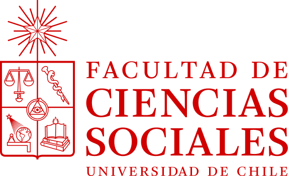
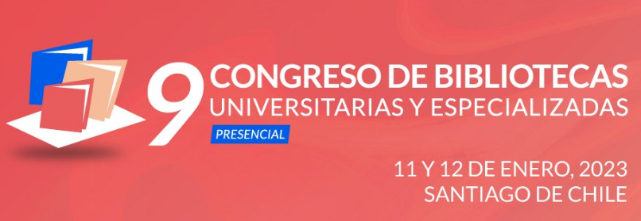
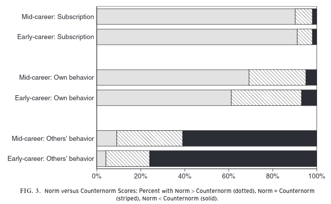
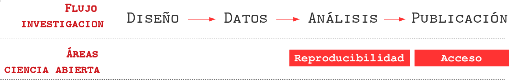
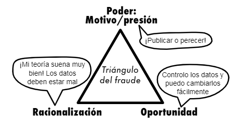
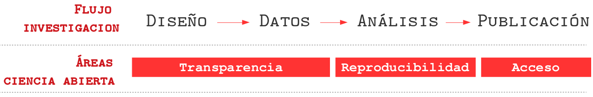
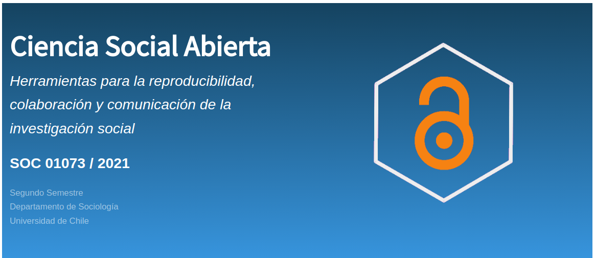

class: front middle center

```{r eval=FALSE, include=FALSE}
# Correr esto para que funcione el infinite moonreader, el root folder debe ser static para si dirigir solo "bajndo" en directorios hacia el bib y otros

xaringan::inf_mr('/static/docpres/02_bases/2mlmbases.Rmd')

o en RStudio:
  - abrir desde carpeta root del proyecto
  - Addins-> infinite moon reader
```


```{r setup, include=FALSE, cache = FALSE}
require("knitr")
options(htmltools.dir.version = FALSE)
pacman::p_load(RefManageR)
# bib <- ReadBib("../../bib/electivomultinivel.bib", check = FALSE)
opts_chunk$set(warning=FALSE,
             message=FALSE,
             echo=FALSE,
             cache = FALSE, fig.width=7, fig.height=5.2)
pacman::p_load(flipbookr, tidyverse)
```


```{r xaringanExtra, echo=FALSE}
xaringanExtra::use_xaringan_extra(c("tile_view", "animate_css"))
xaringanExtra::use_progress_bar(color = "red", location = "top")

# xaringanExtra::use_share_again()
# xaringanExtra::use_scribble()
```

<!---
About macros.js: permite escalar las imágenes como [scale 50%](path to image), hay si que grabar ese archivo js en el directorio.
--->

.pull-left-narrow[

.left[


 


]

]


.pull-right-wide[

.right[
.content-box-gray[

 ## **.red[Flujo y Componentes de la Investigación Abierta]**
----


.small[**.red[Juan Carlos Castillo]** 

Departamento de Sociología, Universidad de Chile]
.small[[.black[jc-castillo.com]](https://jc-castillo.com/)

]
]
]

]


---

layout: true
class: animated, fadeIn

---
class: inverse, middle, right

# ¿Es la .yellow[ciencia] una actividad .red[cerrada]?

---
## Principios éticos de la ciencia 
.center[

]

.right[.small[
(Merton, 1942, 1973)]]

---
class: middle

.pull-left-narrow[
## ¿Se cumplen los principios de la ciencia?
]

.pull-right-wide[
- Investigación de **Anderson et al (2007)**, pregunta a más de **3000** investigadores sobre cumplimiento de principios de la ciencia Mertonianos (agregan dos más: gobernanza y calidad)

- Dos grupos de académicos: carrera temprana y carrera intermedia

- Para todos los principios identifica normas y contranormas:]

---
.center[

]

---
.center[

]
.right[.small[Normas y contra-normas de la ética científica (Anderson, 2007)]]

---
class:middle

.pull-left-narrow[
# Nudos críticos
]


.pull-right-wide[

.content-box-blue[
- barreras de pago (origen en modelo papel) vs internet

- presión por publicar y prácticas cuestionables de investigación

- desconocimiento de apertura científica

- apertura vista como un problema (carga) más que una oportunidad


]

]

---
class: middle

.pull-left[

La **ciencia abierta** refiere a movimientos y prácticas con el objetivo de que:
  - el conocimiento científico esté disponible de forma abierta, accesible y reutilizable para todos
  
  - aumentar las colaboraciones científicas y el intercambio de información en beneficio de la ciencia y la sociedad.


.small[UNESCO, 2021]
]
--

.pull-left[
.center[
<br>
<br>
<br>
.content-box-red[

Implica abrir las diferentes etapas del flujo de producción científica en un momento caraterizado por infraestructuras de conocimiento digital
]
]
]
---
class: inverse, middle, center


# .red[Flujo] de investigación científica y .yellow[áreas] de ciencia abierta 


---
<br>


---
<br>
 


---
class: middle, center

.pull-left[
<br>
<br>
<br>
<br>
# Barreras de pago
]
.pull-right[
.left[

]
]

---
# Márgenes de ganancia

.center[

]

---
class: middle

.pull-left-narrow[
<br>

]

.pull-right-wide[

### Modelo actual de publicación científica:
- las vacas hacen leche (se ordeñan solas)

- otras vacas revisan la leche (gratis)

- las vacas le pagan al granjero para distribuir la leche

- luego el granjero le vende la leche de vuelta a las vacas
]

---
class: inverse, middle, center

# Rutas de accesibilidad

---

.center[

]

---

.center[

]

---
class: middle

Información sobre políticas de acceso de las revistas: [https://v2.sherpa.ac.uk/romeo/](https://v2.sherpa.ac.uk/romeo/)


---
<br>
 



---

.center[


.small[Triángulo del fraude de D. A. Cressey aplicado a las .bold[malas prácticas de investigación]]
]
---
## ¿Qué porcentaje de los estudios publicados son reproducibles?

.pull-left-wide[

]
.pull-right-narrow[
<br>
<br>
<br>
<br>
<br>
<br>
... alrededor de un **40%!** (... varía por disciplina)
]

---
class: center


.small[
Fuente: [Baker (2016) 1,500 scientists lift the lid on reproducibility - Nature](https://www.nature.com/news/1-500-scientists-lift-the-lid-on-reproducibility-1.19970)]

---
<br>
 



---
<br>
 

---
class: inverse

# .red[Desafíos]

.large[- incorporación de nuevos productos en la gestión del conocimiento (pre-registros, pre-prints, datos abiertos, repositorios reproducibles)

- orientación/asesoría al mundo académico

- capacitación y promición de herramientas y prácticas de ciencia abierta
]
---
class: middle center
Más info:

.pull-left[
.content-box-red[


### .medium[**.black[Laboratorio de Investigación Social] .red[Abierta]]**


### [.red[lisa-coes.com]](https://lisa-coes.com/) 
]
]

.pull-right[
.content-box-blue[
## Curso Ciencia Social Abierta


[cienciasocialabierta.netlify.app](https://cienciasocialabierta.netlify.app/)]
]
---
class: front center

.pull-left-narrow[

.left[


<br>
<br>
<br>

<br>

 


]

]


.pull-right-wide[

.right[
.content-box-gray[

 ## **.red[Flujo y Componentes de la Investigación Abierta]**
----


.small[**.red[Juan Carlos Castillo]** .small[[.black[jc-castillo.com]](https://jc-castillo.com/)

Departamento de Sociología, Universidad de Chile]


]
]
]

]


