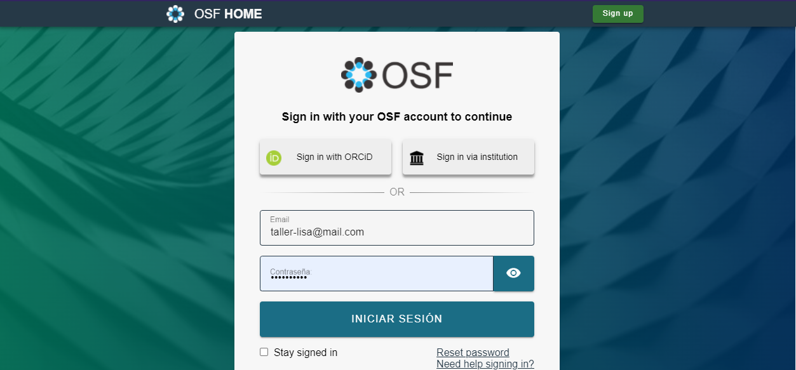
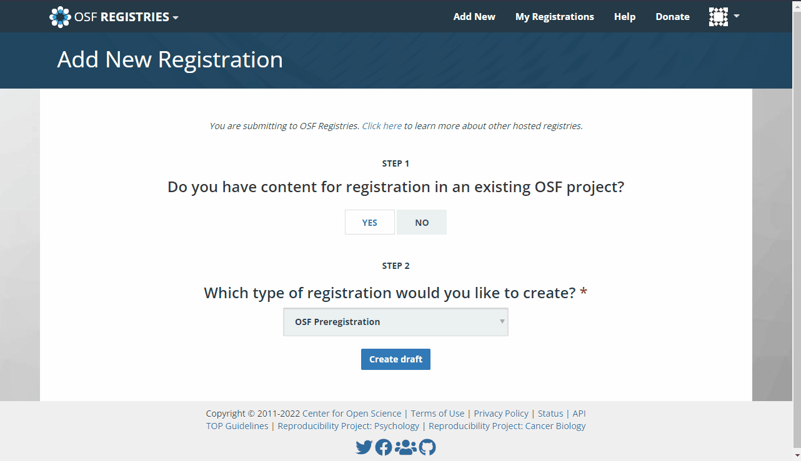
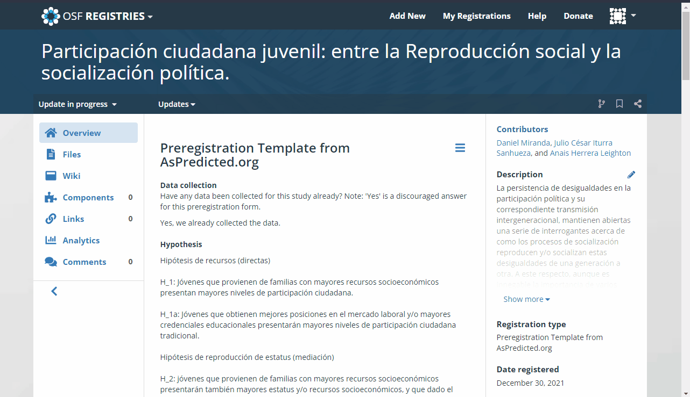
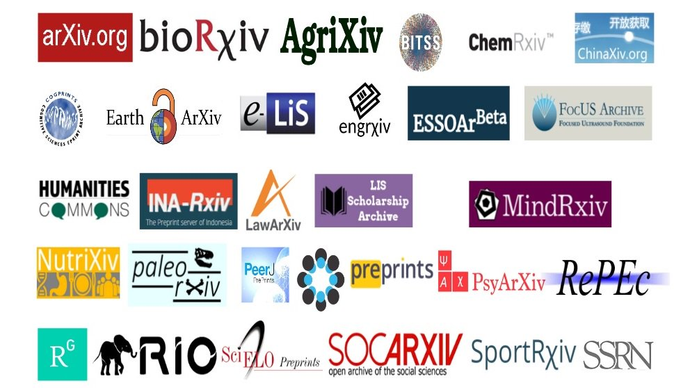
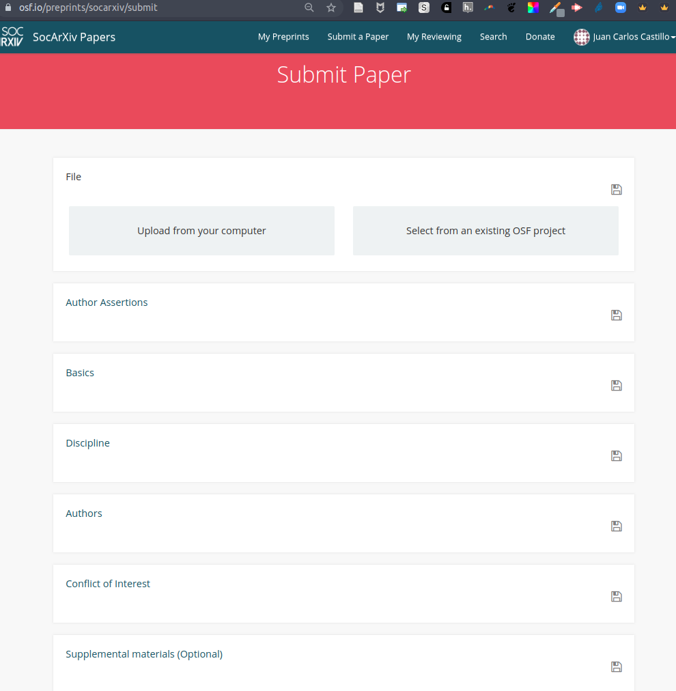

class: front middle center

```{r eval=FALSE, include=FALSE}
# Correr esto para que funcione el infinite moonreader, el root folder debe ser static para si dirigir solo "bajndo" en directorios hacia el bib y otros

xaringan::inf_mr('/static/docpres/02_bases/2mlmbases.Rmd')

o en RStudio:
  - abrir desde carpeta root del proyecto
  - Addins-> infinite moon reader
```


```{r setup, include=FALSE, cache = FALSE}
require("knitr")
options(htmltools.dir.version = FALSE)
pacman::p_load(RefManageR)
# bib <- ReadBib("../../bib/electivomultinivel.bib", check = FALSE)
opts_chunk$set(warning=FALSE,
             message=FALSE,
             echo=FALSE,
             cache = FALSE, fig.width=7, fig.height=5.2)
pacman::p_load(flipbookr, tidyverse)
```


```{r xaringanExtra, echo=FALSE}
xaringanExtra::use_xaringan_extra(c("tile_view", "animate_css"))
xaringanExtra::use_progress_bar(color = "red", location = "top")

# xaringanExtra::use_share_again()
# xaringanExtra::use_scribble()
```

<!---
About macros.js: permite escalar las imágenes como [scale 50%](path to image), hay si que grabar ese archivo js en el directorio.
--->

.right[

]


### .medium[**.black[Laboratorio de Investigación Social] .red[Abierta]]**


### [.red[lisa-coes.com]](https://lisa-coes.com/) 


---

layout: true
class: animated, fadeIn

---


---
class: inverse
.right[
# **.orange[Programa]**
]
<br>
## A. Ciencia abierta: Crisis y herramientas 

## B. Pre-registros 

## C. Pre-prints   

---
class: inverse
.right[
# **.orange[Programa]**
]
<br>
## A. **.yellow[Ciencia abierta: Crisis y herramientas]**

## B. Pre-registros 

## C. Pre-prints   


---
class: roja, middle, right

.pull-left[
# ¿Crisis de apertura en ciencia?
]

.pull-right-wide[

# .yellow[El problema]
]

---
## Principios éticos de la ciencia 
.center[

]

.right[.small[
(Merton, 1942, 1973)]]

---
# ¿Se cumplen los principios de la ciencia?

- Investigación de Anderson et al (2007), pregunta a más de 3000 investigadores sobre cumplimiento de principios de la ciencia Mertonianos (agregan dos más: gobernanza y calidad)

- Dos grupos de académicos: carrera temprana y carrera intermedia

- Para todos los principios identifica normas y contranormas:

---
.center[

]

---
.center[

]
.right[.small[Normas y contra-normas de la ética científica (Anderson, 2007)]]


---
class: roja, middle, right

.pull-left[
# ¿Crisis de apertura en ciencia?
]

.pull-right-wide[

### 1. Transparencia
### 2. Reproducibilidad 
### 3. Acceso
]

---
<br>


---
<br>
 


---
class: middle, center

.pull-left[
<br>
<br>
<br>
<br>
# Barreras de pago
]
.pull-right[
.left[

]
]

---
# Márgenes de ganancia

.center[

]

---
.pull-left-narrow[
<br>

]

.pull-right-wide[

### Modelo actual de publicación científica:
- las vacas hacen leche (se ordeñan solas)

- otras vacas revisan la leche (gratis)

- las vacas le pagan al granjero para distribuir la leche

- luego el granjero le vende la leche de vuelta a las vacas
]

---
<br>
 


---
## ¿Qué porcentaje de los estudios publicados son reproducibles?

.pull-left-wide[

]
.pull-right-narrow[
<br>
<br>
<br>
<br>
<br>
<br>
... alrededor de un **40%!** (... varía por disciplina)
]

---
class: center


.small[
Fuente: [Baker (2016) 1,500 scientists lift the lid on reproducibility - Nature](https://www.nature.com/news/1-500-scientists-lift-the-lid-on-reproducibility-1.19970)]

---
<br>
 


---
<br>
 


---
class: middle center


---
class: middle center
Más info:

#lisa-coes.com

---
class: inverse
.right[
# **.orange[Programa]**
]
<br>
## A. Ciencia abierta: Crisis y herramientas 

## B. .yellow[Pre-registros] 

## C. Pre-prints   

---
class: roja, middle, right

.pull-left[

# Pre-registros

]

.pull-right-wide[

### 1. Prácticas cuestionables de investigación
### 2. Pre-registros
### 3. Plantillas y OSF
]

---
class: roja, right

.pull-left[

# Pre-registros

]

.pull-right-wide[

### 1. .yellow[Prácticas cuestionables de investigación]
### 2. Pre-registros
### 3. Plantillas y OSF
]

---
## El caso de Pedro

- Pedro accede una base de datos con información sobre trabajadores sindicalizados en distintas empresas del país. 

--

- .bold[Sin tener una hipótesis previa], correlaciona  las variables: .green[participación en huelga] (1), .pink[tiempo de afiliación sindical] (2) y .orange[tipo de contrato] (3)

--

- Observa que hay una correlación positiva entre tiempo sindicalizado y participación en huelgas (_r_ = 0,32)

--

- Posterior a mirar los datos establece una hipótesis: a mayor .pink[tiempo de afiliación sindical] (x) existe mayor .green[participación en huelgas] (y)

---

- .red[No encuentra] resultados esperados en base a su hipótesis (tiempo de afiliación sindical impacta positivamente en la participación en huelgas)

--

- Ajusta la variable tiempo, .bold[eliminando casos] que llevan .pink[menos de 2 años sindicalizados en la empresa], obteniendo una asociación significativa con probabilidad de error _p_ <0.05

--

- Finalmente .bold[excluye] a trabajadores a .orange[plazo fijo], manteniendo solo aquellos con contrato indefinido, obteniendo un _p_ <0.01

# .center[🤔?]
---

.center[


.small[Triángulo del fraude de D. A. Cressey aplicado a las .bold[malas prácticas de investigación]]
]

---
class: middle

las .red[prácticas cuestionables de investigación] refieren a las:

>  _"acciones que violan los valores tradicionales de la empresa de investigación y que pueden ser perjudiciales para el proceso de investigación"_ (National Academies of Science 1992 en Steneck, 2006, p. 58).

---
# Algunas consecuencias

- el problema *no es la exploración de datos*, sino su uso en reporte selectivo de resultados de investigación

--

- incrementa la posibilidad de rechazar erróneamente $H_0$

--

- exageraciones de efectos estimados, perjudicando la replicabilidad

--

- se confirma lo que uno está buscando, no lo que entregan los datos (y pierde sentido el recolectar datos, y hacer investigación empírica)

---
class: roja, right

.pull-left[

# Pre-registros

]

.pull-right-wide[

### 1. Prácticas cuestionables de investigación
### 2. .yellow[Pre-registros]
### 3. Plantillas y OSF
]

---
class: middle

## ¿Qué es un pre-registro?

_Un .bolder[pre-registro] es una marca .red[temporal] que busca dar cuenta del diseño de una investigación: .pink[(1) principales hipótesis], .pink[(2) recolección de datos] y .pink[(3) plan de análisis.]_


---
# Características de un pre-registro

- se crea un registro permanente y disponible del plan del estudio .orange[antes de mirar los datos]

- establece una fecha de publicación

- accesible y con opción de resguardo de anonimato de autores (p.ej. OSF)

- .bold[objetivo principal:]  diferenciar aspectos especificados a priori (hipótesis y análisis) de aquellos más exploratorios 


---
# Ventajas de pre-registros

.pull-left[
- transparencia del diseño

- eficiencia en el análisis

- mantener el foco en la .bold[teoría]

- .red[no impide explorar], solo diferenciar .orange[intuiciones exploratorias] de .green[ hipótesis confirmatorias]]

- .bold[Encontrable]: se genera un .blue[.bold[DOI]] que permite citar

- Puede evitar conflictos por co-autorias

- Evitar situaciones de plagio 

.pull-right[
.center[

]
]

---

#  Importancia de las hipótesis confirmatorias

--

* la evidencia previa e hipótesis guiadas por teoría:
--
  
  * permite delimitar correctamente el .orange[fenómeno a explicar] (_explanandum_) y
  
  * establecer cuál(es) conceptos/variables lo explican (_explanans_)
  
  * la .pink[discusión] de resultados abre el camino para investigaciones posteriores

---
# Tipos de preregistro

- **Preregistro (sin revisión)**: simplemente detallar hipótesis, datos y análisis y registar en repositorio apropiado

--

- **Reporte registrado (con revisión)** : 
  - se somete a revisión en revista que permita esta opción
  - de ser aceptado, se publicará independiente de sus resultados
  - permite lidiar con el [.bold[sesgo de publicación]](https://lisa-coes.github.io/lisa-book/por-qu%C3%A9.html#pr%C3%A1cticas-cuestionables-de-investigaci%C3%B3n-qrp)

--

- **Reporte preregistrado de replicación**: para estudios de replicación (misma hipótesis y método, distintos datos)

---
class: roja, right

.pull-left[

# Pre-registros

]

.pull-right-wide[

### 1. Prácticas cuestionables de investigación
### 2. Pre-registros
### 3. .yellow[Plantillas y OSF]
]


---
## Algunos repositorios de pre-prints

* [**Open Science Framework**](https://osf.io/) - la más ampliamente aplicable en las ciencias sociales

* [**AsPredicted.org**](https://aspredicted.org/) - Utilizado principalmente en el ámbito de la psicología

* [**AEA Registry**](http://www.socialscienceregistry.org/) - Se utiliza principalmente en economía

* [**EGAP**](https://egap.org/registry/)  - Ciencia Política principalmente


Fuente: [meta-meta-resources.org](https://meta-meta-resources.org/running-studies/preparation/pre-reg-repos/)

---
## Plantillas de pre-registro

```{r echo=FALSE}
shiny::includeHTML(path = "tab-preregister.html")
```

Fuente: [lisa-coes.com/01componentes/](https://lisa-coes.com/01componentes/)

<!-- --- -->
<!-- # Características de plantillas -->

<!-- - formato de pre-registro que especifica .red[campos a completar] con información necesaria -->

<!-- - existen distintas alternativas según .red[diseño de investigación] -->

<!-- - asociadas a plataformas y plantillas de publicación -->

<!-- --- -->
<!-- ## Campos típicos e información apropiada -->

<!-- <iframe src="datacolada.png"  -->
<!--             height="500"  -->
<!--             width="400"  -->
<!--             marginwidth="50"  -->
<!--             scrolling="yes"> -->
<!-- </iframe> -->

---
class: middle

.pull-left-narrow[
<br>
<br>
<br>
<br>
<br>
[](https://osf.io/)

]

.pull-right-wide[

## Open Science Framework

- .bold[entorno] de apertura de proyectos de investigación completos (más allá de los pre-registros)

- se pueden pre-registrar estudios asociados a un proyecto ya generado en OSF, o de manera independiente

- disponibilidad de [múltiples plantillas de pre-registro](https://osf.io/zab38/wiki/home/)
]

---

## Pre-registrar un estudio en el OSF

- .red[Paso 0:] Crear un usuario en el [Open Science Framework](https://osf.io/) 

.center[[](https://accounts.osf.io/login?service=https://osf.io/dashboard/)]

---

- .red[Paso 1:] Ingresar al sitio web y seleccionar .green[.bold[OSFREGISTRIES]]: 

.center[[](https://osf.io/registries?view_only=)]

---
* .red[Paso 2:] Hacer click en .blue[.bold[Add New]] para crear una nueva entrada

.center[[](https://osf.io/registries?view_only=)]

---
* .red[Paso 3:] Configurar la nueva entrada

.center[[](https://osf.io/registries/osf/new)]


---
* .red[Paso 4:] Completar Metadata

.center[]

---
* .red[Paso 5:] Completar campos de pre-registro y publicar

.center[]

---
##  Anonimizar y compartir

.pull-left-wide[
* Podemos compartir el pre-registro con nuestras autorías 

* Es posible anonimizar para enviar el artículo a revisión (peer review)

* Esto permite que el pre-registro sea revisado sin identificar autorías

* Luego, es posible desanonimizar el pre-registro y mostrar autorías
]

.pull-right-narrow[
<br><br> 
.center[]
]

---

.center[]

---
# Algunos ejemplos ...

.small[
* Miranda, D., Iturra, J. C., & Herrera Leighton, A. (2021, December 30). Participación ciudadana juvenil: entre la Reproducción social y la socialización política. [https://doi.org/10.17605/OSF.IO/5N6J4](https://doi.org/10.17605/OSF.IO/5N6J4)

* Castillo, J. C., Miranda, D., Iturra, J. C., Meneses, F. J., & Venegas, M. (2021, January 29). La socialización de la meritocracia: el efecto de la familia y la escuela. [https://doi.org/10.17605/OSF.IO/FAZDX](https://doi.org/10.17605/OSF.IO/FAZDX)

* Maldonado, L., Castillo, J. C., Iturra, J. C., & Meneses, F. J. (2019, November 19). Does knowledge about inequality and poverty affects the perception of opportunities and meritocracy? An experimental test in Chile. [https://doi.org/10.17605/OSF.IO/3TEWB](https://doi.org/10.17605/OSF.IO/3TEWB)

* Castillo, J. C., Iturra, J. C., Meneses, F. J., & Maldonado, L. (2019, November 21). Perceptions and Preferences for Meritocracy Scale  (PPM-S). [https://doi.org/10.17605/OSF.IO/Z45Y2](https://doi.org/10.17605/OSF.IO/Z45Y2 )
]
---
class: roja, left

# Resumen pre-registros

### - .small[prácticas cuestionables de investigación]

### - .small[investigación exploración vs. hallazgos guiados por teoría]

### - .small[pre-registros: ventajas éticas y de eficiencia]

### - .small[plantillas, campos y accesibilidad]


---

# Referencias

.small[

- [Abril-Ruiz, A. (2019). Manzanas podridas: Malas prácticas de investigación y ciencia descuidada. 10.31234/osf.io/z82mh](10.31234/osf.io/z82mh)

- [Laboratorio Investigación Social Abierta](lisa-coes.com)

- [How To Properly Preregister A Study](http://datacolada.org/64)

- [Lindsay et al (2016) Research Preregistration 101.](https://www.psychologicalscience.org/observer/research-preregistration-101)

- [Nosek, B. A., Ebersole, C. R., DeHaven, A. C., & Mellor, D. T. (2018). The preregistration revolution. Proceedings of the National Academy of Sciences, 115(11), 2600–2606. https://doi.org/10.1073/pnas.1708274114
](https://www.pnas.org/content/115/11/2600) 

- [OSF Preregistration resources](https://www.cos.io/initiatives/prereg)

]

---
class: inverse
.right[
# **.orange[Programa]**
]
<br>
## A. Ciencia abierta: Crisis y herramientas 

## B. Pre-registros

## C. .yellow[Pre-prints]

---
<br>


---
# Bases

- [Declaración de Budapest 2002](https://www.budapestopenaccessinitiative.org/read)

.medium[
_By .red["open access"] to this literature, we mean its **free availability on the public internet**, permitting any users to read, download, copy, distribute, print, search, or link to the full texts of these articles, crawl them for indexing, pass them as data to software, or use them for any other lawful purpose, without financial, legal, or technical barriers other than those inseparable from gaining access to the internet itself._ 

_The .red[only constraint] on reproduction and distribution, and the only role for copyright in this domain, should be to give **authors control over the integrity of their work** and the right to **be properly acknowledged and cited.**_]

---
# Bases

- [Declaración de Berlin 2003](https://openaccess.mpg.de/67605/berlin_declaration_engl.pdf)

.medium[
1. The author(s) and right holder(s) of such contributions grant(s) to all users a free, irrevocable,
worldwide, right of access to, and a license to copy, use, distribute, transmit and display the work
publicly ...

2. A complete version of the work and all supplemental materials, including a copy of the permission
as stated above, in an appropriate standard electronic format is deposited (and thus published) in at
least one online repository

]


.small[Más información: [European Comission Open Acces](https://ec.europa.eu/research/participants/docs/h2020-funding-guide/cross-cutting-issues/open-access-data-management/open-access_en.htm) ]
---
class: inverse, middle, center

# Rutas de accesibilidad

---

.center[

]

---

.center[

]

---
class: middle

Información sobre políticas de acceso de las revistas: [https://v2.sherpa.ac.uk/romeo/](https://v2.sherpa.ac.uk/romeo/)

---
class: roja, bottom, right

# Pre-prints

---
# Preprints

- Los preprints o pre-impresos son publicaciones abiertas de un reporte de investigación, por lo general un artículo, antes de un proceso de revisión por pares

- El objetivo general hacer disponibles y difundir reportes de investigación

- Son referenciables / citables / accesibles

- Pueden ser una versión inicial/borrador o una versión final

- Concepto general: **ciencia en tiempo real**

---


---


.small[
[https://www.natureindex.com/news-blog/what-biorxivs-first-thirty-thousand-preprints-reveal-about-biologists](https://www.natureindex.com/news-blog/what-biorxivs-first-thirty-thousand-preprints-reveal-about-biologists)
]
---
.center[

]
---


---
.center[
]

---

.pull-left-narrow[


[socopen.org](https://socopen.org/)

]

.pull-right-wide[
- Servicio de pre-prints de ciencias sociales vinculado al OSF

- Permite subir documentos (pdf) fácilmente desde proyectos OSF

- Tiene un sistema de _moderación_, un equipo de moderadores realiza un filtro grueso para determinar el carácter académico del pre-print

- Otorga un DOI (digital object identifier), que permite su citación y rastreo académico
]

---
.center[

]
---

.center[

]
---
## Sobre las licencias de trabajos abiertos

- permiten resguardar el derecho de propiedad y reconocimiento (atribución) de quienes crean la obra

- diferentes elementos:
  - posibilidad de "derivar" (adaptar) y publicar un nuevo producto
  - posibilidad de generar derivados comerciales
  - posibilidad de que derivados tengan distintas licencias
  
- más información: [https://creativecommons.org/licenses/](https://creativecommons.org/licenses/)


---
class: roja

## **.yellow[Resumen Pre-prints]**

###- Políticas y rutas de acceso abierto

###- Auge creciente de preprints

###- Publicación en Socarxiv

###- Publicación abierta en tiempo real

---


---
class: front center
.right[

]


### .medium[**.black[Laboratorio de Investigación Social] .red[Abierta]]**


### [.red[lisa-coes.com]](https://lisa-coes.com/) 


  