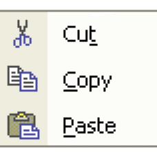
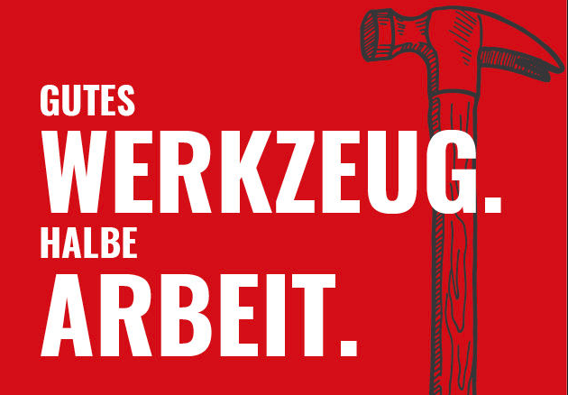
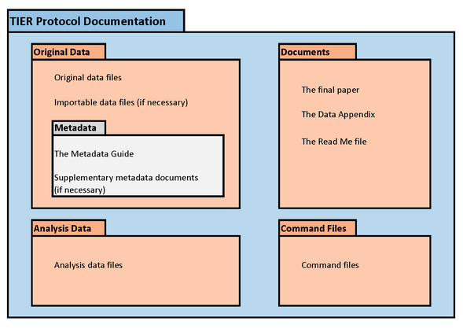

class: front middle

```{r eval=FALSE, include=FALSE}
# Correr esto para que funcione el infinite moonreader, el root folder debe ser static para si dirigir solo "bajndo" en directorios hacia el bib y otros

xaringan::inf_mr('/static/docpres/02_bases/2mlmbases.Rmd')

o en RStudio:
  - abrir desde carpeta root del proyecto
  - Addins-> infinite moon reader
```


```{r setup, include=FALSE, cache = FALSE}
require("knitr")
options(htmltools.dir.version = FALSE)
pacman::p_load(RefManageR)
# bib <- ReadBib("../../bib/electivomultinivel.bib", check = FALSE)
opts_chunk$set(warning=FALSE,
             message=FALSE,
             echo=FALSE,
             cache = FALSE, fig.width=7, fig.height=5.2)
pacman::p_load(flipbookr, tidyverse)
```


```{r xaringanExtra, echo=FALSE}
xaringanExtra::use_xaringan_extra(c("tile_view", "animate_css"))
xaringanExtra::use_progress_bar(color = "red", location = "top")

# xaringanExtra::use_share_again()
# xaringanExtra::use_scribble()
```

<!---
About macros.js: permite escalar las imágenes como [scale 50%](path to image), hay si que grabar ese archivo js en el directorio.
--->

.pull-left-narrow[


<br>
<br>
<br>
<br>
<br>
<br>
<br>

]

.pull-right-wide[


.right[

 # .red[**Protocolos de análisis reproducible y reportes dinámicos**]
 
 .espaciosimple[
.small[Juan Carlos Castillo - UChile] / 
.small[[jc-castillo.com](https://jc-castillo.com/)]

.small[[https://github.com/lisa-coes](https://github.com/lisa-coes)]

]
]
]

---

layout: true
class: animated, fadeIn

---
class: middle center


### .medium[**.black[Laboratorio de Investigación Social] .red[Abierta]]**


### [.red[lisa-coes.com]](https://lisa-coes.com/) 

---
class: inverse
.right[
# **.orange[Programa]**
]
## A. Reproducibilidad

## B. Texto plano y Markdown

## C. RMarkdown

## D. Protocolos reproducibles

---
class: inverse
.right[
# **.orange[Programa]**
]
## A. **.yellow[Reproducibilidad]**

## B. Texto plano y Markdown

## C. RMarkdown

## D. Protocolos reproducibles

---
## Ciencia abierta 
<br>
 


---
class: center 


---
## ¿Qué porcentaje de los estudios publicados son reproducibles?

.pull-left-wide[

]
.pull-right-narrow[
<br>
<br>
<br>
<br>
<br>
<br>
... alrededor de un **40%!** (... varía por disciplina)
]

---
class: center


.small[
Fuente: [Baker (2016) 1,500 scientists lift the lid on reproducibility - Nature](https://www.nature.com/news/1-500-scientists-lift-the-lid-on-reproducibility-1.19970)]

---
class: center middle


.small[
Fuente: [Baker (2016) 1,500 scientists lift the lid on reproducibility - Nature](https://www.nature.com/news/1-500-scientists-lift-the-lid-on-reproducibility-1.19970)]


---
class: middle 

.pull-left-wide[

]

.tiny[
.pull-right-narrow[
[Knudtson, K. L., et al (2019). Survey on Scientific Shared Resource Rigor and Reproducibility. Journal of Biomolecular Techniques : JBT, 30(3), 36–44. https://doi.org/10.7171/jbt.19-3003-001
](https://pubmed.ncbi.nlm.nih.gov/31452645/)
]

]

---
class: center 
.pull-left[
]


---

 .small[[Nosek et al (2015)](https://science.sciencemag.org/content/348/6242/1422)]

---
class: middle, center


---
## Elementos para la .red[reproducibilidad]

- Escritura abierta:  

  - texto simple/plano, libre de software comercial
  - citas
  - documentos dinámicos

--

- Flujo de trabajo documentado y reproducible

--

- Carpeta de proyecto autocontenida y transferible

--

- Repositorio con datos y código de análisis abierto

--

- Control de versiones


---
class: inverse
.right[
# **.orange[Programa]**
]
## A. Reproducibilidad

## B. **.yellow[Texto plano y Markdown]**

## C. RMarkdown

## D. Protocolos reproducibles

---
## Flujo de trabajo con procesador de texto tradicional

.center[

]

---
## Abriendo el archivo de escritura tradicional


---
## Desventajas del procesador tradicional

.pull-left-wide[
.medium[

- Barrera de **pago/licencia** para acceder a contenidos (propiedad)

- Difícil **versionamiento** y llevar registro de quién hizo qué cambio, barrera a la reproducibilidad y colaboración 

- No permite un documento enteramente **reproducible** que combine texto y código de análisis (en caso de utilizarlo) ]
]

.pull-right-narrow[
<br>
<br>


]


---
.pull-left-narrow[
## Escritura libre y abierta
]

<br>
.pull-right-wide[
.content-box-red[
- independiente de programa comercial

- independiente de plataformas específicas

- permite combinar texto y análisis en un mismo documento

- foco en los contenidos en lugar del formato

- permite distintas opciones de formato final]]

---
# Inspiración

.center[
]

---
## Funcionamiento de escritura simple / plana

.content-box-red[
- entorno: editor de texto

- separación entre texto de entrada (input) y texto de salida (output)

- foco en el input/contenido vs output/formato

- marcas de edición: vínculo entre formato de input y output

- sin cortar / pegar
 ]

---
# Marcas de edición

- Vínculo entre escritura en texto simple (input) y output


---
## Principales Alternativas escritura simple

.left-column[
## **Latex**

## .grey[Markdown]
]

.right-column[

- sistema de escritura simple de amplio uso en la academia

- alta calidad en salida a pdf

- creado a comienzos de los 80 (Donald Knuth, Leslie Lamport)


]

---
## Principales Alternativas escritura simple

.left-column[
## **Latex**

## .grey[Markdown]
]

.right-column[


]

---
## Principales Alternativas escritura simple

.left-column[
## .grey[Latex]

## **Markdown**
]

.right-column[

.medium[
- creado por John Gruber y Aaron Swartz en 2004

- forma de escritura simple con pocas marcas de formato

- conversión a distintos formatos de salida (html, pdf)

- Soporta encabezados, tablas, imágenes, tablas de contenidos, ecuaciones, links ...

- filosofía: foco en contenido primero, el formato después.
]

]


---
## Principales Alternativas escritura simple

.left-column[
## .grey[Latex]

## **Markdown**
]

.right-column[
.right[
]
]

---
## Principales Alternativas escritura simple

.left-column[
## .grey[Latex]

## **Markdown**
]
.right-column[
.right[

]]


---
## Principales Alternativas escritura simple

<br>


|          	| **Control de formato** 	| **Marcas de edición** 	| **Formatos de salida** 	|
|----------	|:--------------------:|:----------------:|:--------------------:|
| LaTeX    	|          +         	|        +       	|          -         	|
| Markdown 	|          -         	|        -       	|          +         	|

---

## Markdown, pandoc y renderización


---
## Ejemplos de marcas de edición en Markdown

.content-box-red[
- Texto en **negrita** entre dos astericos: `**negrita**`

- Texto en *cursiva* con un asterico por lado: ` *cursiva*`

- Títulos se marcan con `#` al principio, subtítulos `##` , y así sucesivamente

- Imágenes: ``

- Links: `[](link-web)`]


---
.content-box-red[
# Práctica
]
- [.blue[Tutorial de markdown online]](https://www.markdowntutorial.com/es/)

- [.blue[Markdown cheatsheet]](https://www.markdownguide.org/cheat-sheet/)

---
class: inverse
.right[
# **.orange[Programa]**
]
## A. Reproducibilidad

## B. Texto plano y Markdown]**

## C. **.yellow[RMarkdown]**

## D. Protocolos reproducibles

---
## Problemas de reproducibilidad en documentos de investigación

.pull-left[

- Proceso tradicional: cortar y pegar resultados en el documento de texto

- Dificulta la **reproducibilidad**: ¿de dónde salieron esos resultados?
]


.pull-right[
.center[

]
]

---
## Desafiando el modelo cortar & pegar

.content-box-red[
- **Ideal de reproducibilidad**: documento donde se combine texto y código que genera resultados presentados.

- **Limitación procesadores de texto**: no permiten incorporar código & resultados de manera eficiente

- **Limitación software de análisis**: permiten incorporar texto solo en un formato plano, no publicable]

---
##  Alternativa en entorno R: Knitr (Tejer)

.pull-left-narrow[


]

.pull-right-wide[
- Librería R que genera documentos dinámicos, combinando (tejiendo) texto y código en una misma hoja

- Diferentes opciones de formato de salida (html, pdf, word)

- Basada en una versión de Markdown llamada RMarkdown

]


---
# Funcionamiento ([Healey](https://plain-text.co/))


---
## Funcionamiento

.content-box-red[
1. Artículo `RMarkdown` (.Rmd) combina texto plano Markdown y código de análisis `R`

2. `Knitr` (_cniter_ o _kaniter_) genera un archivo Markdown (.md) a partir del Rmd

3. El archivo Markdown puede ser transformado por `pandoc` a diferentes formatos de salida publicable]

.small[Nota: `pandoc` se instala automáticamente con RStudio, no requiere instalación aparte]

---
class: roja, bottom, right


# RMarkdown

---
# RMarkdown: Acepciones

.pull-left-narrow[

]

.pull-right-wide[
- Lenguaje que combina código (R) y texto (Markdown)

- Hoja de código escrita en RMarkdown (documento RMarkdown)

- Librería de R que provee de una serie de herramientas para generar documentos dinámicos y publicarlos
]
---
# Librería RMarkdown

- Instalar la librería (o actualizarla, si está cargada) : `install.packages("rmarkdown")`

- Al instalarla, también incorpora otras librerías (dependencies) que permiten trabajar y publicar con **RMarkdown** (como `knitr` y también `tinitex`, que permite generación documentos pdf vía Latex).

---
## Iniciar documento RMarkdown en RStudio

- RStudio ha ido progresivamente incorporando adaptaciones a la escritura en RMarkdown

- Para generar documento RMarkdown: File > New File > R Markdown

- Luego pide unas opciones para generar un documento ejemplo (posteriormente se puede borrar el contenido).

---
## Iniciar documento RMarkdown en RStudio

.center[

]
---
## Iniciar documento RMarkdown en RStudio

.pull-left-narrow[
<br>

]

.pull-right-wide[


- El documento ejemplo tiene un breve encabezado YAML (Yet Another Markdown Language), donde se especifican opciones generales del documento entre tres guiones (`---`)

- También por defecto genera un chunk inicial de opciones (setup) para todo el documento (opcional)

]

---
## Escritura en RMarkdown

- permite incluir **trozos de código (chunks)**  en el texto

- un chunk se especifica mediante una línea de código inicial ` ```{r}`, y se cierra con ` ``` `

`Aquí texto `

````
```{r}`r ''`
1 + 1
```
````
`Aquí sigue el texto`

---
# Insertar chunks

Se pueden insertar rápidamente de la siguiente manera:

- Menú en ventana de RStudio *Insert* > R 

- o, combinación `Ctrl + Alt + i`

---
class: roja, middle, right

# Opciones de chunks

---
## Opciones (principales) de chunks

1. Mostrar código y resultado

2. Mostrar solo el código

3. Mostrar solo el resultado

4. No mostrar ni código ni resultado

5. Mostrar código sin ejecutarlo

6. Entregar resultado en formato directo (ej: html o latex)

---
## Especificación de opciones

- las opciones se anotan dentro de la llave inicial posterior a la letra r: `{r [opciones]}`

- las opciones principales son:

  - mostrar código `{r echo=TRUE/FALSE}`
  - mostrar resultado `{r results='markup'/'hide'}`

- estas opciones se visualizan al momento de procesar el documento en algún formato de salida. A este procesamiento se le denomina **renderizar** (del ingles _render_ ... no hay buena traducción)

---
## 1. Mostrar código y resultado (opción por defecto)

````
```{r}`r ''`
1 + 1
```
````
(equivale a `{r echo=TRUE results='markup'}`)

Renderiza

```{r echo=TRUE}
1 + 1
```

---
## 2. Solo código, ocultando resultados:

````
```{r, results='hide'}`r ''`
1 + 1
```
````

Renderiza:

```{r echo=TRUE, results='hide'}
1 + 1
```

---
## 3. Solo resultado

````
```{r, echo=FALSE}`r ''`
1 + 1
```
````

Renderiza :
 
```{r, echo=FALSE, results='markup'}
1 + 1
```

---
## 4. Ni código ni resultado

````
```{r echo=FALSE results='hide'}`r ''`
1 + 1
```
````

No renderiza

Se usa cuando se ejecuta un comando necesario pero que no se requiere/necesita dejar visible en el documento de salida (Ej: cargar base de datos)


---
## 5. Código sin ejecutar

````
```{r, eval=FALSE}`r ''`
1 + 1
```
````

Se puede usar para dar un ejemplo de código que no requiere ser ejecutado


---
## 6. Resultado en formato directo de salida


````
```{r, results='asis'}`r ''`
stargazer(datos1, type="html")
```
````

- se utiliza principalmente para comandos de generación de tablas, que arrojan un código que luego puede ser interpretado por otro lenguaje (por ejemplo, html o LaTeX)

---
class: roja bottom right

# Knitr

---
.pull-left-wide[
## Generando documento con Knitr
- Knitr es una librería de R, se instala automáticamente al instalar `rmarkdown`

- El documento se genera al presionar el botón `Knitr` (que activa función de la librería)

- También al desplegar el menú se pueden elegir opciones de formato
]

.pull-right-narrow[
.right[
<br>
<br>
<br>

]
]

---
# Sobre formatos de salida

.content-box-green[
- La conversión más simple y rápida es a html.

- El resultado aparece en el visor (Viewer) de R, o se puede seleccionar otra opción de visualización desde la rueda de configuración al lado del botón `knitr`

- El documento queda grabado como archivo (ej: probando.html) en el mismo directorio del archivo .Rmd]

---
## Sobre formatos de salida: En Visor de RStudio

.center[
]

---
class: inverse

## .red[Resumen RMarkdown]

.pull-left[
  - Documentos dinámicos:
  - "tejiendo" texto y código de análisis en texto plano
  - reproducibilidad

- Documentos dinámicos en R / RStudio

  - knitr
  - RMarkdown
  - chunks y opciones]

.pull-right[

]

---
class: inverse
.right[
# **.orange[Programa]**
]
## A. Reproducibilidad

## B. Texto plano y Markdown]**

## C. RMarkdown

## D. **.yellow[Protocolos reproducibles]**

---
## ¿Cómo organizar el flujo de trabajo?

### A. Estilo personal (ad-hoc)

### B. Protocolo reproducible

---
## ¿Cómo organizar el flujo de trabajo?

.content-box-red[
### .red[A. ad-hoc (menos reproducible)]
  - cada investigador define numero de archivos, nombres, carpetas y organización
  
  - explicar al resto cómo se organiza
  - documentar en un archivo cómo se organiza
  
--> reproducibilidad y transparencia **LIMITADA** ] 

---
## ¿Cómo organizar el flujo de trabajo?

.content-box-purple[
### .red[B. *Protocolo* de trabajo reproducible]

  - **estructura** de carpetas y archivos interconectados que refieren a reglas conocidas
  
  - **autocontenido**: toda la información necesaria para la reproducibilidad se encuentra en la carpeta raíz o directorio de trabajo.]

---
## Estándares de reproducibilidad

.center[

]

---
.pull-left-narrow[
## Ejemplo protocolo reproducible: [TIER](https://www.projecttier.org/)]

.pull-right-wide[
<br>
<br>
<br>
.center[

]]

---
.pull-left-narrow[
# Protocolo TIER
]

.pull-right-wide[
<br>
<br>

]

---

.center[
.medium[
###[https://lisa-coes.github.io/ipo/](https://lisa-coes.github.io/ipo/)

]
]

---
### Protocolo IPO - Estructura de archivos y carpetas

.center[

]

---
## Protocolo IPO en contexto R/RMarkdown

.content-box-red[
- RMarkdown tiene una lógica en sí reproducible, y puede simplificar el uso de protocolos.

- Si todo el procesamiento se hace en el mismo documento paper.Rmd, entonces basta con la carpeta input de IPO.

- Recomendación: realizar la preparación en código externo (carpeta proc) y el análisis en el paper.Rmd.

- Es solo una **propuesta**, el sentido último es la reproducibilidad más que el cumplimiento estricto]

---
## Proyectos autocontenidos 

- reproducible sin necesidad de archivos externos al directorio

- requisito: establecer **directorio de trabajo**

  - posición de referencia de todas las operaciones al interior del proyecto
  
  - también llamado **directorio raíz**
  
---
## Estableciendo directorio de trabajo

- forma tradicionalen R: 

  - `setwd(ruta-a-carpeta-de-proyecto)`

  - problemas: hace referencia a ruta local en el computador donde se está trabajando, por lo tanto no es reproducible y **se debe evitar**
  
- alternativa sugerida en R: **RStudio Projects**  

---
# RStudio Projects

.content-box-red[
- La funcionalidad **Projects** de RStudio permite establecer claramente un directorio de trabajo de manera eficiente

- Para ello, genera un archivo de extensión **.Rproj** en el directorio raiz de la carpeta del proyecto

- Luego se facilita acceder a la carpeta del proyecto en RStudio ejecutando desde el administrador de archivos del computador (file manager) el archivo **.Rproj** 

- para comprobar, ejecutar `getwd()` y debería dar la ruta hacia la carpeta del proyecto
]
---
.pull-left[
## RStudio Projects
- File -> New Project


]

.pull-right[
<br>
<br>
<br>
<br>


]

---
## RStudio Projects

.center[

]

---
## Abriendo la sesión de RStudio como proyecto

<br>
- identificar en la carpeta respectiva el archivo .Rproj

- ejecutar y se abre R / RStudio desde ese directorio como raíz


---
class: inverse

## .red[Resumen General]

### - ciencia abierta y reproducibilidad

### - texto plano y Markdown

### -  Rmarkdown y documentos dinámicos

### - Protocolo de proyecto reproducible

---
class: middle center
Más info:

## web: [lisa-coes.com](https://lisa-coes.com/)

## Github: [github.com/lisa-coes](https://github.com/lisa-coes)


---
class: front middle

.pull-left-narrow[


<br>
<br>
<br>
<br>
<br>
<br>
<br>

]

.pull-right-wide[


.right[

 # .red[**Protocolos de análisis reproducible y reportes dinámicos**]
 
 .espaciosimple[
.small[Juan Carlos Castillo - UChile] / 
.small[[jc-castillo.com](https://jc-castillo.com/)]
]
]
]

